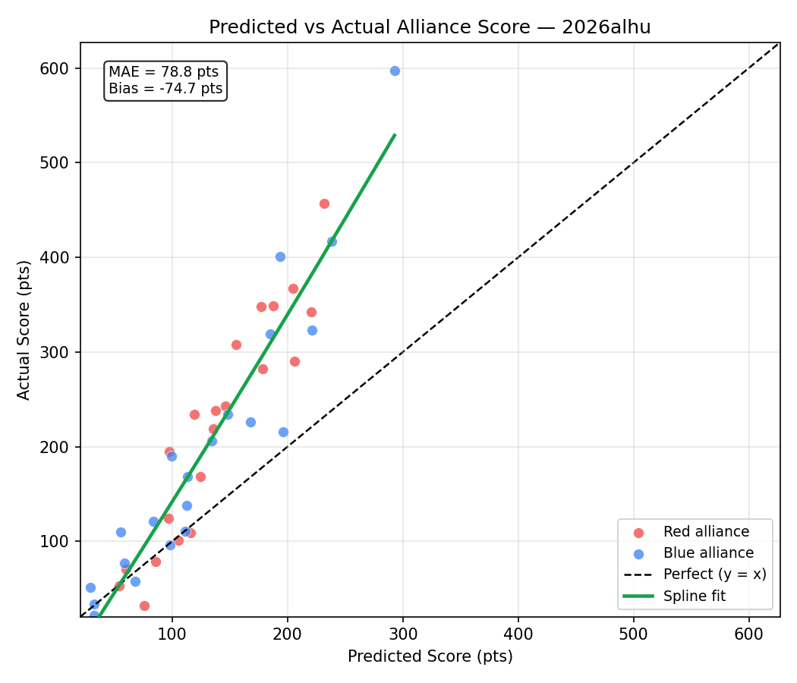

# Event Preview — Rocket City Regional

**Event key:** `2026alhu`  
**Generated:** 2026-04-10  
**Status:** 21 of 80 matches played  
**Prediction accuracy (completed):** 18/21 = 85.7%  

> Scores are carry-forward estimates from prior events. Teams marked **Current** have live estimates computed from this event. Teams marked *(est. avg)* have no prior data and use the field median.

## Event Details

| Field | Value |
|:------|:------|
| Name | Rocket City Regional |
| Event Key | `2026alhu` |
| Week | Week 6 |
| Dates | 2026-04-08 – 2026-04-11 |
| Location | Huntsville, AL, USA |

## Team Information (49 teams)

| Rank | Team | Nickname | City | St | Score | Vol | Fuel Auto | Fuel Tlp | Tower Auto | Tower EG | Penalty | Defend | Last Seen |
|-----:|-----:|:---------|:-----|:---|------:|----:|----------:|---------:|-----------:|---------:|--------:|-------:|:----------|
| 1 | 2481 | Roboteers | Tremont | Illinois | 132.4 | 41.0 | 37.4 | 95.5 | 0.0 | 0.0 | 0.6 | 0.0 | Current |
| 2 | 4504 | B. C. Robotics | Maryville | Tennessee | 104.6 | 41.0 | 20.3 | 84.8 | 0.0 | 0.0 | 0.6 | 0.0 | Current |
| 3 | 5740 | Trojanators | Cranberry Township | Pennsylvania | 89.8 | 41.0 | 28.5 | 61.3 | 0.0 | 0.0 | 0.0 | 0.0 | Current |
| 4 | 9401 | Midas' Mayhem | Troy | Missouri | 83.7 | 41.0 | 21.6 | 68.5 | 0.0 | 0.0 | 6.5 | 0.0 | Current |
| 5 | 2638 | Rebel Robotics | Great Neck | New York | 82.9 | 41.0 | 17.2 | 66.2 | 0.0 | 0.0 | 0.6 | 0.0 | Current |
| 6 | 4020 | Cyber Tribe | Kingsport | Tennessee | 82.4 | 41.0 | 21.2 | 67.1 | 0.0 | 0.0 | 5.9 | 0.0 | Current |
| 7 | 2783 | Engineers of Tomorrow | La Grange | Kentucky | 81.4 | 41.0 | 16.9 | 66.0 | 0.0 | 0.0 | 1.6 | 0.0 | Current |
| 8 | 2393 | Robotichauns | Knoxville | Tennessee | 78.0 | 41.0 | 18.4 | 59.7 | 0.0 | 0.0 | 0.2 | 0.0 | Current |
| 9 | 1466 | Webb Robotics | Knoxville | Tennessee | 66.5 | 41.0 | 21.6 | 45.5 | 0.0 | 0.0 | 0.6 | 0.0 | Current |
| 10 | 3959 | Mech Tech | Somerville | Alabama | 63.7 | 41.0 | 17.7 | 46.4 | 0.0 | 0.0 | 0.4 | 0.0 | Current |
| 11 | 7515 | Dark Side Robotics | Williamstown | West Virginia | 60.7 | 41.0 | 11.9 | 39.6 | 9.2 | 0.0 | 0.0 | 0.0 | Current |
| 12 | 2556 | RadioActive Roaches | Niceville | Florida | 57.5 | 41.0 | 9.1 | 65.6 | 0.0 | 0.0 | 17.2 | 0.0 | Current |
| 13 | 11037 | Clarksville Cyber Storm | Clarksville | Tennessee | 55.6 | 41.0 | 14.8 | 41.4 | 0.0 | 0.0 | 0.6 | 0.0 | Current |
| 14 | 1912 | Team Combustion | Slidell | Louisiana | 54.2 | 41.0 | 9.5 | 40.0 | 0.0 | 4.7 | 0.0 | 0.0 | Current |
| 15 | 744 | Shark Attack | Fort Lauderdale | Florida | 52.6 | 41.0 | 10.2 | 43.3 | 0.0 | 0.0 | 0.9 | 0.0 | Current |
| 16 | 120 | Youth Tech Academy Red Dragons | Cleveland | Ohio | 47.6 | 41.0 | 7.8 | 39.7 | 0.0 | 0.0 | 0.0 | 0.0 | Current |
| 17 | 5002 | Dragon Robotics | Collierville | Tennessee | 46.8 | 41.0 | 11.8 | 34.9 | 0.0 | 0.0 | 0.0 | 0.0 | Current |
| 18 | 10137 | RoboKats | Lexington | Kentucky | 46.7 | 41.0 | 11.1 | 36.2 | 0.0 | 0.0 | 0.6 | 0.0 | Current |
| 19 | 3201 | Ross Rambotics | Hamilton | Ohio | 46.6 | 22.4 | 11.2 | 37.5 | 0.0 | 0.0 | 2.1 | 11.8 | Wk3 Buckeye Regional |
| 20 | 5492 | Winner's Circle Robo Jockey's | Louisville | Kentucky | 46.1 | 41.0 | 8.7 | 37.4 | 0.0 | 0.0 | 0.0 | 0.0 | Current |
| 21 | 3492 | Putnam Area Robotics Team (P.A.R.T.s) | Winfield | West Virginia | 44.6 | 41.0 | 11.3 | 33.3 | 0.0 | 0.0 | 0.0 | 0.0 | Current |
| 22 | 6517 | So-Kno Robo | Knoxville | Tennessee | 44.6 | 41.0 | 8.8 | 35.8 | 0.0 | 0.0 | 0.0 | 0.0 | Current |
| 23 | 4150 | FRobotics | Murrysville | Pennsylvania | 42.1 | 41.0 | 9.0 | 33.2 | 0.0 | 0.0 | 0.0 | 0.0 | Current |
| 24 | 10961 | Hyper Wave | Gulf Shores | Alabama | 40.2 | 41.0 | 10.1 | 30.1 | 0.0 | 0.0 | 0.0 | 0.0 | Current |
| 25 | 538 | Renaissance Robotics | Athens | Alabama | 40.0 | 41.0 | 15.5 | 42.8 | 0.0 | 0.0 | 18.3 | 0.0 | Current |
| 26 | 11173 | STAR FORCE | Chicago | Illinois | 39.3 | 41.0 | 0.6 | 42.0 | 0.0 | 0.0 | 3.3 | 0.0 | Current |
| 27 | 9067 | The Goonies | Searcy | Arkansas | 39.1 | 41.0 | 10.3 | 28.7 | 0.0 | 0.0 | 0.0 | 0.0 | Current |
| 28 | 7111 | RAD Robotics | Huntsville | Alabama | 37.4 | 14.8 | 8.1 | 36.9 | 0.0 | 0.0 | 7.6 | 22.8 | Wk3 Smoky Mountains Regi |
| 29 | 3260 | SHARP | Pittsburgh | Pennsylvania | 33.8 | 41.0 | 6.6 | 27.2 | 0.0 | 0.0 | 0.0 | 0.0 | Current |
| 30 | 4107 | Team Storm | Long Beach | Mississippi | 32.7 | 41.0 | 11.3 | 35.3 | 0.0 | 0.0 | 13.8 | 0.0 | Current |
| 31 | 3966 | Gryphon Command | Knoxville | Tennessee | 32.7 | 41.0 | 9.1 | 23.6 | 0.0 | 0.0 | 0.0 | 2.9 | Current |
| 32 | 5842 | Royal Robotics | New Port Richey | Florida | 28.9 | 41.0 | 1.5 | 27.3 | 0.0 | 0.0 | 0.0 | 0.0 | Current |
| 33 | 3984 | Topper Robotics | Johnson City | Tennessee | 27.8 | 41.0 | 8.3 | 19.5 | 0.0 | 0.0 | 0.0 | 0.0 | Current |
| 34 | 34 | Rockets | Athens | Alabama | 27.4 | 41.0 | 7.2 | 20.2 | 0.0 | 0.0 | 0.0 | 0.0 | Current |
| 35 | 5045 | SpartaBot | Memphis | Tennessee | 27.2 | 41.0 | 6.8 | 28.2 | 0.0 | 0.0 | 7.8 | 0.0 | Current |
| 36 | 8778 | HSUWerx | Fort Walton Beach | Florida | 26.1 | 14.8 | 3.4 | 20.5 | 0.0 | 2.2 | 0.0 | 0.0 | Wk3 Smoky Mountains Regi |
| 37 | 4265 | Secret City Wildbots | Oak Ridge | Tennessee | 25.0 | 41.0 | 6.8 | 18.3 | 0.0 | 0.0 | 0.0 | 0.0 | Current |
| 38 | 6107 | CyberJagzz | Huntsville | Alabama | 17.0 | 41.0 | 0.0 | 17.0 | 0.0 | 0.0 | 0.0 | 0.0 | Current |
| 39 | 9153 | Bearcat Robotics | Ruston | Louisiana | 16.5 | 41.0 | 3.2 | 11.4 | 0.0 | 6.3 | 4.3 | 0.0 | Current |
| 40 | 1308 | Wildcat Robotics | Cleveland | Ohio | 16.4 | 41.0 | 2.5 | 13.8 | 0.0 | 0.0 | 0.0 | 4.7 | Current |
| 41 | 4306 | Robokomodos | Franklin | Tennessee | 15.1 | 41.0 | 0.0 | 15.1 | 0.0 | 0.0 | 0.0 | 0.0 | Current |
| 42 | 7525 | Pioneers | Nashville | Tennessee | 15.1 | 41.0 | 12.2 | 34.0 | 0.0 | 0.0 | 31.1 | 0.0 | Current |
| 43 | 5125 | Hawks on the Horizon | Chicago | Illinois | 13.3 | 41.0 | 5.8 | 7.5 | 0.0 | 0.0 | 0.0 | 0.0 | Current |
| 44 | 3140 | Flagship | Knoxville | Tennessee | 12.8 | 41.0 | 2.4 | 10.4 | 0.0 | 0.0 | 0.0 | 0.0 | Current |
| 45 | 8624 | Sasquatch Robotics | Andalusia | Alabama | 5.1 | 41.0 | 3.0 | 10.2 | 0.0 | 0.0 | 8.1 | 0.9 | Current |
| 46 | 7428 | Gigawatts | Fort Payne | Alabama | 2.3 | 14.8 | 0.7 | 1.6 | 0.0 | 0.0 | 0.0 | 8.2 | Wk3 Smoky Mountains Regi |
| 47 | 7917 | Frontier | Nashville | Tennessee | 1.9 | 41.0 | 1.1 | 0.9 | 0.0 | 0.0 | 0.0 | 0.0 | Current |
| 48 | 2973 | Mad Rockers | Madison | Alabama | 0.0 | 41.0 | 0.0 | 0.0 | 0.0 | 0.0 | 0.0 | 0.0 | Current |
| 49 | 3792 | Army Ants | Columbia | Missouri | -0.5 | 41.0 | 1.1 | 0.0 | 0.0 | 0.0 | 1.7 | 4.5 | Current |

## Completed Matches — Predictions vs Actuals (21 played, accuracy: 18/21 = 85.7%)

| Match | Red Alliance | Blue Alliance | Pred Red | Pred Blue | Win% Red | Act Red | Act Blue | Winner | Correct |
|:------|:-------------|:--------------|----------:|----------:|---------:|--------:|---------:|:------:|:-------:|
| QM1 | 2481(1) / 538 / 4306 | 6517 / 9067 / 3984 | 187 | 111 | 78% | 349 | 111 | 🔴 RED | ✅ |
| QM2 | 9401(4) / 1466(9) / 11037 | 2783(7) / 2556 / 5492 | 206 | 185 | 58% | 290 | 319 | 🔵 BLUE | ❌ |
| QM3 | 11173 / 4107 / 4265 | 9153 / 5125 / 3792 | 97 | 29 | 75% | 124 | 51 | 🔴 RED | ✅ |
| QM4 | 744 / 10961 / 3140 | 5740(3) / 4150 / 1308 | 106 | 148 | 34% | 101 | 234 | 🔵 BLUE | ✅ |
| QM5 | 5002 / 8624 / 7917 | 1912 / 34 / 7428 | 54 | 84 | 37% | 53 | 121 | 🔵 BLUE | ✅ |
| QM6 | 3959 / 3492 / 5045 | 4020(6) / 2393(8) / 7515 | 135 | 221 | 20% | 219 | 323 | 🔵 BLUE | ✅ |
| QM7 | 3201 / 5842 / 2973 | 10137 / 7111 / 7525 | 75 | 99 | 39% | 32 | 190 | 🔵 BLUE | ✅ |
| QM8 | 4504(2) / 2638(5) / 3966 | 120 / 3260 / 6107 | 220 | 98 | 89% | 342 | 96 | 🔴 RED | ✅ |
| QM9 | 2783(7) / 538 / 4265 | 744 / 4150 / 11173 | 146 | 134 | 55% | 243 | 206 | 🔴 RED | ✅ |
| QM10 | 11037 / 1308 / 5125 | 3984 / 8624 / 3792 | 85 | 32 | 70% | 79 | 34 | 🔴 RED | ✅ |
| QM11 | 9401(4) / 2393(8) / 9153 | 2481(1) / 1466(9) / 9067 | 178 | 238 | 28% | 282 | 417 | 🔵 BLUE | ✅ |
| QM12 | 5740(3) / 7515 / 1912 | 2556 / 5842 / 5045 | 205 | 114 | 82% | 367 | 168 | 🔴 RED | ✅ |
| QM13 | 2638(5) / 120 / 5002 | 3959 / 10137 / 7917 | 177 | 112 | 74% | 348 | 138 | 🔴 RED | ✅ |
| QM14 | 4504(2) / 4020(6) / 6517 | 34 / 7525 / 3140 | 232 | 55 | 96% | 457 | 110 | 🔴 RED | ✅ |
| QM15 | 5492 / 3492 / 3260 | 6107 / 4306 / 2973 | 124 | 32 | 82% | 168 | 22 | 🔴 RED | ✅ |
| QM17 | 2393(8) / 3984 / 5125 | 9401(4) / 2556 / 744 | 119 | 194 | 23% | 234 | 401 | 🔵 BLUE | ✅ |
| QM18 | 3959 / 5842 / 8624 | 538 / 9153 / 7917 | 98 | 58 | 65% | 195 | 77 | 🔴 RED | ✅ |
| QM19 | 7515 / 4150 / 3140 | 2638(5) / 1466(9) / 10137 | 116 | 196 | 21% | 109 | 216 | 🔵 BLUE | ✅ |
| QM20 | 2783(7) / 11173 / 6107 | 5740(3) / 6517 / 3260 | 138 | 168 | 38% | 238 | 226 | 🔴 RED | ❌ |
| QM21 | 3966 / 5045 / 2973 | 34 / 4265 / 4306 | 60 | 68 | 47% | 71 | 58 | 🔴 RED | ❌ |
| QM22 | 4020(6) / 10961 / 4107 | 2481(1) / 4504(2) / 11037 | 155 | 293 | 9% | 308 | 597 | 🔵 BLUE | ✅ |

## Upcoming Matches — Predictions (59 remaining)

| Match | Red Alliance | Blue Alliance | Pred Red | Pred Blue | Win% Red | Favored |
|:------|:-------------|:--------------|----------:|----------:|---------:|:--------|
| QM16 | 7111 / 4107 / 7428 | 3201 / 10961 / 3966 | 72 | 120 | 27% | 🔵 BLUE |
| QM23 | 5002 / 5492 / 7525 | 3492 / 7111 / 3792 | 108 | 82 | 61% | 🔴 RED |
| QM24 | 9067 / 1308 / 7428 | 1912 / 120 / 3201 | 58 | 148 | 15% | 🔵 BLUE |
| QM25 | 2783(7) / 2393(8) / 3260 | 7515 / 5125 / 7917 | 193 | 76 | 88% | 🔴 RED |
| QM26 | 3984 / 4306 / 3140 | 11173 / 5842 / 9153 | 56 | 85 | 39% | 🔵 BLUE |
| QM27 | 5740(3) / 1466(9) / 6107 | 11037 / 538 / 4107 | 173 | 128 | 67% | 🔴 RED |
| QM28 | 2638(5) / 5045 / 7525 | 2556 / 3492 / 10961 | 125 | 142 | 43% | 🔵 BLUE |
| QM29 | 3201 / 9067 / 3792 | 4504(2) / 8624 / 2973 | 85 | 110 | 40% | 🔵 BLUE |
| QM30 | 2481(1) / 10137 / 34 | 1912 / 744 / 7111 | 207 | 144 | 75% | 🔴 RED |
| QM31 | 9401(4) / 4020(6) / 5492 | 120 / 4150 / 7428 | 212 | 92 | 90% | 🔴 RED |
| QM32 | 3959 / 3966 / 4265 | 5002 / 6517 / 1308 | 121 | 108 | 55% | 🔴 RED |
| QM33 | 3984 / 7525 / 7917 | 11037 / 5045 / 3140 | 45 | 96 | 31% | 🔵 BLUE |
| QM34 | 5740(3) / 538 / 3792 | 2638(5) / 2393(8) / 3201 | 129 | 207 | 20% | 🔵 BLUE |
| QM35 | 2783(7) / 744 / 10137 | 9067 / 4107 / 4306 | 181 | 87 | 82% | 🔴 RED |
| QM36 | 1912 / 6107 / 5125 | 4020(6) / 4150 / 9153 | 84 | 141 | 29% | 🔵 BLUE |
| QM37 | 2481(1) / 9401(4) / 3492 | 3959 / 34 / 1308 | 261 | 108 | 94% | 🔴 RED |
| QM38 | 5002 / 3260 / 3966 | 5492 / 10961 / 5842 | 113 | 115 | 49% | EVEN |
| QM39 | 2556 / 120 / 7111 | 6517 / 11173 / 8624 | 143 | 89 | 72% | 🔴 RED |
| QM40 | 1466(9) / 7428 / 2973 | 4504(2) / 7515 / 4265 | 69 | 190 | 10% | 🔵 BLUE |
| QM41 | 2638(5) / 744 / 3792 | 4020(6) / 1912 / 4306 | 135 | 152 | 43% | 🔵 BLUE |
| QM42 | 5740(3) / 2783(7) / 9153 | 10137 / 3492 / 1308 | 188 | 108 | 79% | 🔴 RED |
| QM43 | 5492 / 9067 / 34 | 3959 / 10961 / 5125 | 113 | 117 | 48% | EVEN |
| QM44 | 2556 / 4150 / 7917 | 2481(1) / 4107 / 3966 | 102 | 198 | 17% | 🔵 BLUE |
| QM45 | 1466(9) / 3201 / 11173 | 5002 / 5045 / 6107 | 152 | 91 | 74% | 🔴 RED |
| QM46 | 2393(8) / 120 / 6517 | 11037 / 3984 / 2973 | 170 | 83 | 81% | 🔴 RED |
| QM47 | 4504(2) / 5842 / 7525 | 9401(4) / 4265 / 8624 | 149 | 114 | 64% | 🔴 RED |
| QM48 | 7515 / 3260 / 7428 | 538 / 7111 / 3140 | 97 | 90 | 53% | EVEN |
| QM49 | 4020(6) / 9067 / 5125 | 5740(3) / 3966 / 7917 | 135 | 124 | 54% | EVEN |
| QM50 | 2556 / 3201 / 34 | 2783(7) / 3959 / 3792 | 132 | 145 | 44% | 🔵 BLUE |
| QM51 | 2481(1) / 11173 / 1308 | 2638(5) / 5492 / 2973 | 188 | 129 | 72% | 🔴 RED |
| QM52 | 1466(9) / 6517 / 4107 | 9401(4) / 1912 / 5842 | 144 | 167 | 41% | 🔵 BLUE |
| QM53 | 7515 / 11037 / 7525 | 744 / 5002 / 4306 | 131 | 114 | 57% | 🔴 RED |
| QM54 | 4504(2) / 3492 / 7428 | 4150 / 3260 / 3984 | 152 | 104 | 70% | 🔴 RED |
| QM55 | 120 / 10137 / 9153 | 10961 / 538 / 5045 | 111 | 107 | 51% | EVEN |
| QM56 | 7111 / 6107 / 8624 | 2393(8) / 4265 / 3140 | 60 | 116 | 27% | 🔵 BLUE |
| QM57 | 1466(9) / 1912 / 3966 | 3959 / 11173 / 2973 | 153 | 103 | 69% | 🔴 RED |
| QM58 | 5492 / 6517 / 7917 | 5740(3) / 744 / 3201 | 93 | 189 | 15% | 🔵 BLUE |
| QM59 | 11037 / 3260 / 3792 | 3492 / 4150 / 9067 | 89 | 126 | 36% | 🔵 BLUE |
| QM60 | 7515 / 34 / 9153 | 120 / 4107 / 7525 | 105 | 95 | 54% | EVEN |
| QM61 | 9401(4) / 7111 / 5045 | 2638(5) / 538 / 5125 | 148 | 136 | 55% | 🔴 RED |
| QM62 | 4504(2) / 6107 / 3140 | 2481(1) / 2783(7) / 5002 | 134 | 261 | 10% | 🔵 BLUE |
| QM63 | 5842 / 1308 / 4306 | 2393(8) / 2556 / 7428 | 60 | 138 | 20% | 🔵 BLUE |
| QM64 | 10137 / 10961 / 8624 | 4020(6) / 3984 / 4265 | 92 | 135 | 33% | 🔵 BLUE |
| QM65 | 11173 / 9067 / 7917 | 1466(9) / 3492 / 7525 | 80 | 126 | 32% | 🔵 BLUE |
| QM66 | 11037 / 6517 / 34 | 2638(5) / 3260 / 9153 | 128 | 133 | 48% | EVEN |
| QM67 | 4504(2) / 1912 / 538 | 5492 / 3966 / 5125 | 199 | 92 | 86% | 🔴 RED |
| QM68 | 744 / 4107 / 5045 | 1308 / 3140 / 2973 | 112 | 29 | 80% | 🔴 RED |
| QM69 | 2481(1) / 3201 / 4265 | 9401(4) / 7515 / 120 | 204 | 192 | 55% | 🔴 RED |
| QM70 | 5002 / 4150 / 10961 | 2393(8) / 4306 / 8624 | 129 | 98 | 62% | 🔴 RED |
| QM71 | 2556 / 6107 / 3792 | 10137 / 5842 / 7428 | 74 | 78 | 48% | EVEN |
| QM72 | 5740(3) / 4020(6) / 3959 | 2783(7) / 7111 / 3984 | 236 | 147 | 83% | 🔴 RED |
| QM73 | 744 / 538 / 1308 | 4504(2) / 1466(9) / 3260 | 109 | 205 | 17% | 🔵 BLUE |
| QM74 | 120 / 3492 / 4265 | 1912 / 4107 / 3140 | 117 | 100 | 57% | 🔴 RED |
| QM75 | 5492 / 4150 / 8624 | 7515 / 6517 / 5045 | 93 | 132 | 35% | 🔵 BLUE |
| QM76 | 10961 / 2973 / 3792 | 9401(4) / 6107 / 7917 | 40 | 103 | 27% | 🔵 BLUE |
| QM77 | 5002 / 5842 / 3984 | 2638(5) / 2783(7) / 9067 | 103 | 203 | 16% | 🔵 BLUE |
| QM78 | 2556 / 9153 / 4306 | 4020(6) / 3201 / 7111 | 89 | 166 | 19% | 🔵 BLUE |
| QM79 | 5740(3) / 7525 / 5125 | 2481(1) / 3959 / 7428 | 118 | 198 | 19% | 🔵 BLUE |
| QM80 | 2393(8) / 11037 / 10137 | 11173 / 3966 / 34 | 180 | 99 | 79% | 🔴 RED |

## Prediction Statistics

### Score Prediction Accuracy

Based on **21 completed matches** (42 alliance-score observations).

| Metric | Value |
|:-------|------:|
| Mean Absolute Error (MAE) | 78.8 pts |
| Root Mean Squared Error (RMSE) | 106.0 pts |
| Mean Bias (pred − actual) | -74.7 pts |
| Win prediction accuracy | 18/21 = 85.7% |

### Predicted vs Actual Score by Actual Score Range

| Actual Score Range | Matches | Avg Predicted | Avg Actual | Avg Error | Abs Error |
|:-------------------|--------:|--------------:|-----------:|----------:|----------:|
| 0–50 | 3 | 47 | 29 | +17 | 18 |
| 50–100 | 7 | 65 | 69 | -5 | 10 |
| 100–150 | 7 | 97 | 116 | -19 | 22 |
| 150–200 | 4 | 109 | 180 | -72 | 72 |
| 200–250 | 8 | 148 | 227 | -79 | 79 |
| 250–300 | 2 | 192 | 286 | -94 | 94 |
| 300–350 | 6 | 191 | 332 | -140 | 140 |
| 350–400 | 1 | 205 | 367 | -162 | 162 |
| 400–450 | 2 | 216 | 409 | -193 | 193 |
| 450–500 | 1 | 232 | 457 | -225 | 225 |
| 550–600 | 1 | 293 | 597 | -304 | 304 |

### Win Prediction Calibration

Rows grouped by the predicted confidence for the favored alliance.

| Confidence Band | Matches | Correct | Accuracy |
|:----------------|--------:|--------:|---------:|
| 50–60% | 3 | 1 | 33% |
| 60–70% | 5 | 4 | 80% |
| 70–80% | 7 | 7 | 100% |
| 80–90% | 4 | 4 | 100% |
| 90–100% | 2 | 2 | 100% |
