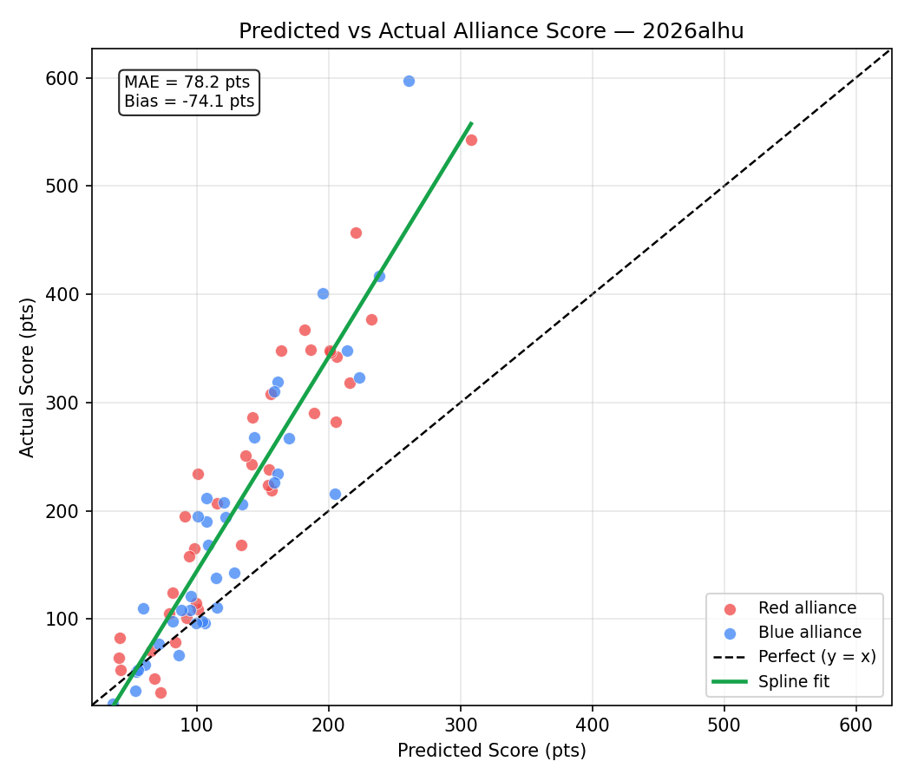

# Event Preview — Rocket City Regional

**Event key:** `2026alhu`  
**Generated:** 2026-04-10  
**Status:** 37 of 80 matches played  
**Prediction accuracy (completed):** 35/37 = 94.6%  

> Scores are carry-forward estimates from prior events. Teams marked **Current** have live estimates computed from this event. Teams marked *(est. avg)* have no prior data and use the field median.

## Event Details

| Field | Value |
|:------|:------|
| Name | Rocket City Regional |
| Event Key | `2026alhu` |
| Week | Week 6 |
| Dates | 2026-04-08 – 2026-04-11 |
| Location | Huntsville, AL, USA |

## Team Information (49 teams)

| Rank | Team | Nickname | City | St | Score | Vol | Fuel Auto | Fuel Tlp | Tower Auto | Tower EG | Penalty | Defend | Last Seen |
|-----:|-----:|:---------|:-----|:---|------:|----:|----------:|---------:|-----------:|---------:|--------:|-------:|:----------|
| 1 | 2481 | Roboteers | Tremont | Illinois | 136.6 | 41.5 | 40.6 | 97.6 | 0.0 | 0.0 | 1.6 | 0.0 | Current |
| 2 | 9401 | Midas' Mayhem | Troy | Missouri | 96.8 | 41.5 | 26.9 | 69.9 | 0.0 | 0.0 | 0.0 | 0.0 | Current |
| 3 | 4020 | Cyber Tribe | Kingsport | Tennessee | 95.6 | 41.5 | 26.3 | 69.4 | 0.0 | 0.0 | 0.0 | 0.0 | Current |
| 4 | 2638 | Rebel Robotics | Great Neck | New York | 91.7 | 41.5 | 26.4 | 70.1 | 0.0 | 0.0 | 4.8 | 0.0 | Current |
| 5 | 2783 | Engineers of Tomorrow | La Grange | Kentucky | 89.0 | 41.5 | 15.9 | 73.0 | 0.0 | 0.0 | 0.0 | 0.0 | Current |
| 6 | 4504 | B. C. Robotics | Maryville | Tennessee | 81.7 | 41.5 | 15.9 | 65.8 | 0.0 | 0.0 | 0.0 | 0.0 | Current |
| 7 | 5740 | Trojanators | Cranberry Township | Pennsylvania | 80.0 | 41.5 | 20.4 | 59.5 | 0.0 | 0.0 | 0.0 | 0.0 | Current |
| 8 | 2393 | Robotichauns | Knoxville | Tennessee | 77.2 | 41.5 | 19.5 | 62.7 | 0.0 | 3.1 | 8.1 | 0.0 | Current |
| 9 | 3492 | Putnam Area Robotics Team (P.A.R.T.s) | Winfield | West Virginia | 74.5 | 41.5 | 16.4 | 58.2 | 0.0 | 0.0 | 0.2 | 0.0 | Current |
| 10 | 10137 | RoboKats | Lexington | Kentucky | 62.4 | 41.5 | 14.2 | 48.2 | 0.0 | 0.0 | 0.0 | 0.0 | Current |
| 11 | 1912 | Team Combustion | Slidell | Louisiana | 52.1 | 41.5 | 4.5 | 47.6 | 0.0 | 0.0 | 0.0 | 0.0 | Current |
| 12 | 9067 | The Goonies | Searcy | Arkansas | 51.2 | 41.5 | 14.2 | 37.0 | 0.0 | 0.0 | 0.0 | 0.0 | Current |
| 13 | 1466 | Webb Robotics | Knoxville | Tennessee | 50.3 | 41.5 | 9.5 | 40.8 | 0.0 | 0.0 | 0.0 | 0.0 | Current |
| 14 | 7515 | Dark Side Robotics | Williamstown | West Virginia | 50.0 | 41.5 | 11.6 | 27.1 | 6.9 | 4.3 | 0.0 | 0.0 | Current |
| 15 | 3959 | Mech Tech | Somerville | Alabama | 49.9 | 41.5 | 15.8 | 39.8 | 0.0 | 0.0 | 5.7 | 0.0 | Current |
| 16 | 744 | Shark Attack | Fort Lauderdale | Florida | 49.5 | 41.5 | 7.3 | 42.2 | 0.0 | 0.0 | 0.0 | 0.0 | Current |
| 17 | 2556 | RadioActive Roaches | Niceville | Florida | 48.9 | 41.5 | 9.1 | 58.6 | 0.0 | 0.0 | 18.8 | 0.0 | Current |
| 18 | 120 | Youth Tech Academy Red Dragons | Cleveland | Ohio | 46.6 | 41.5 | 5.0 | 41.6 | 0.0 | 0.0 | 0.0 | 0.0 | Current |
| 19 | 3201 | Ross Rambotics | Hamilton | Ohio | 44.8 | 41.5 | 10.6 | 37.3 | 0.0 | 0.0 | 3.0 | 0.0 | Current |
| 20 | 6517 | So-Kno Robo | Knoxville | Tennessee | 43.3 | 41.5 | 7.9 | 37.3 | 0.0 | 0.0 | 1.8 | 0.0 | Current |
| 21 | 4150 | FRobotics | Murrysville | Pennsylvania | 42.7 | 41.5 | 10.1 | 32.6 | 0.0 | 0.0 | 0.0 | 0.0 | Current |
| 22 | 11037 | Clarksville Cyber Storm | Clarksville | Tennessee | 42.0 | 41.5 | 13.8 | 28.1 | 0.0 | 0.0 | 0.0 | 0.0 | Current |
| 23 | 11173 | STAR FORCE | Chicago | Illinois | 41.9 | 41.5 | 5.1 | 39.7 | 0.0 | 0.0 | 2.9 | 0.0 | Current |
| 24 | 1308 | Wildcat Robotics | Cleveland | Ohio | 38.3 | 41.5 | 5.4 | 32.9 | 0.0 | 0.0 | 0.0 | 0.0 | Current |
| 25 | 538 | Renaissance Robotics | Athens | Alabama | 37.4 | 41.5 | 9.0 | 34.7 | 0.0 | 0.0 | 6.3 | 0.0 | Current |
| 26 | 3260 | SHARP | Pittsburgh | Pennsylvania | 35.5 | 41.5 | 8.2 | 27.3 | 0.0 | 0.0 | 0.0 | 0.0 | Current |
| 27 | 10961 | Hyper Wave | Gulf Shores | Alabama | 35.2 | 41.5 | 10.4 | 30.4 | 0.0 | 0.0 | 5.6 | 0.0 | Current |
| 28 | 34 | Rockets | Athens | Alabama | 33.5 | 41.5 | 7.0 | 32.4 | 0.0 | 0.0 | 6.0 | 0.0 | Current |
| 29 | 3966 | Gryphon Command | Knoxville | Tennessee | 33.0 | 41.5 | 10.7 | 22.2 | 0.0 | 0.0 | 0.0 | 0.0 | Current |
| 30 | 5045 | SpartaBot | Memphis | Tennessee | 32.1 | 41.5 | 6.5 | 28.0 | 0.0 | 0.0 | 2.5 | 0.0 | Current |
| 31 | 9153 | Bearcat Robotics | Ruston | Louisiana | 31.4 | 41.5 | 10.1 | 20.3 | 0.0 | 2.1 | 1.1 | 0.0 | Current |
| 32 | 5842 | Royal Robotics | New Port Richey | Florida | 27.6 | 41.5 | 1.6 | 26.0 | 0.0 | 0.0 | 0.0 | 0.0 | Current |
| 33 | 7111 | RAD Robotics | Huntsville | Alabama | 26.5 | 41.5 | 8.0 | 25.4 | 0.0 | 0.0 | 6.9 | 14.1 | Current |
| 34 | 8778 | HSUWerx | Fort Walton Beach | Florida | 26.1 | 14.8 | 3.4 | 20.5 | 0.0 | 2.2 | 0.0 | 0.0 | Wk3 Smoky Mountains Regi |
| 35 | 5002 | Dragon Robotics | Collierville | Tennessee | 25.9 | 41.5 | 6.5 | 21.3 | 0.0 | 0.0 | 1.8 | 0.0 | Current |
| 36 | 4107 | Team Storm | Long Beach | Mississippi | 24.9 | 41.5 | 4.0 | 26.5 | 0.0 | 0.0 | 5.7 | 0.0 | Current |
| 37 | 6107 | CyberJagzz | Huntsville | Alabama | 24.1 | 41.5 | 0.0 | 24.1 | 0.0 | 0.0 | 0.0 | 0.0 | Current |
| 38 | 5492 | Winner's Circle Robo Jockey's | Louisville | Kentucky | 23.7 | 41.5 | 8.1 | 15.6 | 0.0 | 0.0 | 0.0 | 0.0 | Current |
| 39 | 3984 | Topper Robotics | Johnson City | Tennessee | 20.5 | 41.5 | 8.9 | 16.2 | 0.0 | 0.0 | 4.6 | 0.0 | Current |
| 40 | 3792 | Army Ants | Columbia | Missouri | 19.3 | 41.5 | 2.3 | 19.5 | 0.0 | 0.0 | 2.5 | 4.1 | Current |
| 41 | 7525 | Pioneers | Nashville | Tennessee | 18.2 | 41.5 | 8.1 | 23.6 | 0.0 | 0.0 | 13.6 | 0.0 | Current |
| 42 | 4265 | Secret City Wildbots | Oak Ridge | Tennessee | 15.1 | 41.5 | 10.7 | 16.5 | 0.0 | 0.0 | 12.1 | 0.0 | Current |
| 43 | 8624 | Sasquatch Robotics | Andalusia | Alabama | 13.4 | 41.5 | 5.5 | 8.8 | 0.0 | 0.0 | 0.8 | 0.0 | Current |
| 44 | 4306 | Robokomodos | Franklin | Tennessee | 12.3 | 41.5 | 0.0 | 12.3 | 0.0 | 0.0 | 0.0 | 0.0 | Current |
| 45 | 7428 | Gigawatts | Fort Payne | Alabama | 9.9 | 41.5 | 4.1 | 5.8 | 0.0 | 0.0 | 0.0 | 0.0 | Current |
| 46 | 3140 | Flagship | Knoxville | Tennessee | 7.8 | 41.5 | 6.2 | 9.2 | 0.0 | 0.0 | 7.5 | 0.0 | Current |
| 47 | 5125 | Hawks on the Horizon | Chicago | Illinois | 3.1 | 41.5 | 0.0 | 2.0 | 0.0 | 1.1 | 0.0 | 0.0 | Current |
| 48 | 7917 | Frontier | Nashville | Tennessee | 2.5 | 41.5 | 0.8 | 6.1 | 0.0 | 0.0 | 4.4 | 0.0 | Current |
| 49 | 2973 | Mad Rockers | Madison | Alabama | 0.0 | 41.5 | 0.0 | 0.0 | 0.0 | 0.0 | 0.0 | 0.0 | Current |

## Completed Matches — Predictions vs Actuals (37 played, accuracy: 35/37 = 94.6%)

| Match | Red Alliance | Blue Alliance | Pred Red | Pred Blue | Win% Red | Act Red | Act Blue | Winner | Correct |
|:------|:-------------|:--------------|----------:|----------:|---------:|--------:|---------:|:------:|:-------:|
| QM1 | 2481(1) / 538 / 4306 | 9067 / 6517 / 3984 | 186 | 115 | 76% | 349 | 111 | 🔴 RED | ✅ |
| QM2 | 9401(2) / 1466 / 11037 | 2783(5) / 2556 / 5492 | 189 | 162 | 61% | 290 | 319 | 🔵 BLUE | ❌ |
| QM3 | 11173 / 4107 / 4265 | 9153 / 3792 / 5125 | 82 | 54 | 61% | 124 | 51 | 🔴 RED | ✅ |
| QM4 | 744 / 10961 / 3140 | 5740(7) / 4150 / 1308 | 92 | 161 | 25% | 101 | 234 | 🔵 BLUE | ✅ |
| QM5 | 5002 / 8624 / 7917 | 1912 / 34 / 7428 | 42 | 95 | 30% | 53 | 121 | 🔵 BLUE | ✅ |
| QM6 | 3492(9) / 3959 / 5045 | 4020(3) / 2393(8) / 7515 | 156 | 223 | 26% | 219 | 323 | 🔵 BLUE | ✅ |
| QM7 | 3201 / 5842 / 2973 | 10137 / 7111 / 7525 | 72 | 107 | 37% | 32 | 190 | 🔵 BLUE | ✅ |
| QM8 | 2638(4) / 4504(6) / 3966 | 120 / 3260 / 6107 | 206 | 106 | 84% | 342 | 96 | 🔴 RED | ✅ |
| QM9 | 2783(5) / 538 / 4265 | 744 / 4150 / 11173 | 141 | 134 | 53% | 243 | 206 | 🔴 RED | ✅ |
| QM10 | 11037 / 1308 / 5125 | 3984 / 3792 / 8624 | 83 | 53 | 62% | 79 | 34 | 🔴 RED | ✅ |
| QM11 | 9401(2) / 2393(8) / 9153 | 2481(1) / 9067 / 1466 | 206 | 238 | 37% | 282 | 417 | 🔵 BLUE | ✅ |
| QM12 | 5740(7) / 1912 / 7515 | 2556 / 5045 / 5842 | 182 | 109 | 76% | 367 | 168 | 🔴 RED | ✅ |
| QM13 | 2638(4) / 120 / 5002 | 10137 / 3959 / 7917 | 164 | 115 | 69% | 348 | 138 | 🔴 RED | ✅ |
| QM14 | 4020(3) / 4504(6) / 6517 | 34 / 7525 / 3140 | 221 | 59 | 94% | 457 | 110 | 🔴 RED | ✅ |
| QM15 | 3492(9) / 3260 / 5492 | 6107 / 4306 / 2973 | 134 | 36 | 83% | 168 | 22 | 🔴 RED | ✅ |
| QM17 | 2393(8) / 3984 / 5125 | 9401(2) / 744 / 2556 | 101 | 195 | 18% | 234 | 401 | 🔵 BLUE | ✅ |
| QM18 | 3959 / 5842 / 8624 | 538 / 9153 / 7917 | 91 | 71 | 58% | 195 | 77 | 🔴 RED | ✅ |
| QM19 | 7515 / 4150 / 3140 | 2638(4) / 10137 / 1466 | 100 | 204 | 15% | 109 | 216 | 🔵 BLUE | ✅ |
| QM20 | 2783(5) / 11173 / 6107 | 5740(7) / 6517 / 3260 | 155 | 159 | 48% | 238 | 226 | 🔴 RED | ❌ |
| QM21 | 3966 / 5045 / 2973 | 34 / 4265 / 4306 | 65 | 61 | 52% | 71 | 58 | 🔴 RED | ✅ |
| QM22 | 4020(3) / 10961 / 4107 | 2481(1) / 4504(6) / 11037 | 156 | 260 | 15% | 308 | 597 | 🔵 BLUE | ✅ |
| QM23 | 5002 / 5492 / 7525 | 3492(9) / 7111 / 3792 | 68 | 120 | 30% | 45 | 208 | 🔵 BLUE | ✅ |
| QM24 | 9067 / 1308 / 7428 | 1912 / 120 / 3201 | 99 | 143 | 33% | 115 | 268 | 🔵 BLUE | ✅ |
| QM25 | 2783(5) / 2393(8) / 3260 | 7515 / 5125 / 7917 | 202 | 56 | 92% | 346 | 53 | 🔴 RED | ✅ |
| QM26 | 3984 / 4306 / 3140 | 11173 / 9153 / 5842 | 41 | 101 | 28% | 64 | 195 | 🔵 BLUE | ✅ |
| QM27 | 5740(7) / 1466 / 6107 | 11037 / 538 / 4107 | 154 | 104 | 69% | 224 | 98 | 🔴 RED | ✅ |
| QM28 | 2638(4) / 5045 / 7525 | 3492(9) / 2556 / 10961 | 142 | 159 | 44% | 286 | 310 | 🔵 BLUE | ✅ |
| QM29 | 9067 / 3201 / 3792 | 4504(6) / 8624 / 2973 | 115 | 95 | 58% | 207 | 108 | 🔴 RED | ✅ |
| QM30 | 2481(1) / 10137 / 34 | 1912 / 744 / 7111 | 233 | 128 | 85% | 377 | 143 | 🔴 RED | ✅ |
| QM31 | 9401(2) / 4020(3) / 5492 | 120 / 4150 / 7428 | 216 | 99 | 87% | 318 | 96 | 🔴 RED | ✅ |
| QM32 | 3959 / 3966 / 4265 | 6517 / 1308 / 5002 | 98 | 108 | 46% | 165 | 212 | 🔵 BLUE | ✅ |
| QM33 | 3984 / 7525 / 7917 | 11037 / 5045 / 3140 | 41 | 82 | 34% | 83 | 98 | 🔵 BLUE | ✅ |
| QM34 | 5740(7) / 538 / 3792 | 2638(4) / 2393(8) / 3201 | 137 | 214 | 22% | 251 | 348 | 🔵 BLUE | ✅ |
| QM35 | 2783(5) / 10137 / 744 | 9067 / 4107 / 4306 | 201 | 88 | 87% | 348 | 108 | 🔴 RED | ✅ |
| QM36 | 1912 / 6107 / 5125 | 4020(3) / 4150 / 9153 | 79 | 170 | 19% | 105 | 267 | 🔵 BLUE | ✅ |
| QM37 | 2481(1) / 9401(2) / 3492(9) | 3959 / 1308 / 34 | 308 | 122 | 97% | 543 | 194 | 🔴 RED | ✅ |
| QM38 | 3260 / 3966 / 5002 | 10961 / 5842 / 5492 | 94 | 86 | 53% | 158 | 67 | 🔴 RED | ✅ |

## Upcoming Matches — Predictions (43 remaining)

| Match | Red Alliance | Blue Alliance | Pred Red | Pred Blue | Win% Red | Favored |
|:------|:-------------|:--------------|----------:|----------:|---------:|:--------|
| QM16 | 7111 / 4107 / 7428 | 3201 / 10961 / 3966 | 61 | 113 | 31% | 🔵 BLUE |
| QM39 | 2556 / 120 / 7111 | 6517 / 11173 / 8624 | 122 | 99 | 59% | 🔴 RED |
| QM40 | 1466 / 7428 / 2973 | 4504(6) / 7515 / 4265 | 60 | 147 | 20% | 🔵 BLUE |
| QM41 | 2638(4) / 744 / 3792 | 4020(3) / 1912 / 4306 | 161 | 160 | 50% | EVEN |
| QM42 | 2783(5) / 5740(7) / 9153 | 3492(9) / 10137 / 1308 | 200 | 175 | 60% | 🔴 RED |
| QM43 | 9067 / 34 / 5492 | 3959 / 10961 / 5125 | 108 | 88 | 58% | 🔴 RED |
| QM44 | 2556 / 4150 / 7917 | 2481(1) / 3966 / 4107 | 94 | 194 | 16% | 🔵 BLUE |
| QM45 | 1466 / 3201 / 11173 | 5045 / 5002 / 6107 | 137 | 82 | 71% | 🔴 RED |
| QM46 | 2393(8) / 120 / 6517 | 11037 / 3984 / 2973 | 167 | 63 | 85% | 🔴 RED |
| QM47 | 4504(6) / 5842 / 7525 | 9401(2) / 4265 / 8624 | 127 | 125 | 51% | EVEN |
| QM48 | 7515 / 3260 / 7428 | 538 / 7111 / 3140 | 95 | 72 | 59% | 🔴 RED |
| QM49 | 4020(3) / 9067 / 5125 | 5740(7) / 3966 / 7917 | 150 | 115 | 63% | 🔴 RED |
| QM50 | 2556 / 3201 / 34 | 2783(5) / 3959 / 3792 | 127 | 158 | 38% | 🔵 BLUE |
| QM51 | 2481(1) / 11173 / 1308 | 2638(4) / 5492 / 2973 | 217 | 115 | 84% | 🔴 RED |
| QM52 | 1466 / 6517 / 4107 | 9401(2) / 1912 / 5842 | 118 | 177 | 28% | 🔵 BLUE |
| QM53 | 7515 / 11037 / 7525 | 744 / 5002 / 4306 | 110 | 88 | 59% | 🔴 RED |
| QM54 | 4504(6) / 3492(9) / 7428 | 4150 / 3260 / 3984 | 166 | 99 | 75% | 🔴 RED |
| QM55 | 10137 / 120 / 9153 | 538 / 10961 / 5045 | 140 | 105 | 64% | 🔴 RED |
| QM56 | 7111 / 6107 / 8624 | 2393(8) / 4265 / 3140 | 64 | 100 | 36% | 🔵 BLUE |
| QM57 | 1912 / 1466 / 3966 | 3959 / 11173 / 2973 | 135 | 92 | 67% | 🔴 RED |
| QM58 | 6517 / 5492 / 7917 | 5740(7) / 744 / 3201 | 70 | 174 | 15% | 🔵 BLUE |
| QM59 | 11037 / 3260 / 3792 | 3492(9) / 9067 / 4150 | 97 | 168 | 24% | 🔵 BLUE |
| QM60 | 7515 / 34 / 9153 | 120 / 4107 / 7525 | 115 | 90 | 60% | 🔴 RED |
| QM61 | 9401(2) / 5045 / 7111 | 2638(4) / 538 / 5125 | 155 | 132 | 59% | 🔴 RED |
| QM62 | 4504(6) / 6107 / 3140 | 2481(1) / 2783(5) / 5002 | 114 | 252 | 9% | 🔵 BLUE |
| QM63 | 1308 / 5842 / 4306 | 2393(8) / 2556 / 7428 | 78 | 136 | 28% | 🔵 BLUE |
| QM64 | 10137 / 10961 / 8624 | 4020(3) / 3984 / 4265 | 111 | 131 | 42% | 🔵 BLUE |
| QM65 | 9067 / 11173 / 7917 | 3492(9) / 1466 / 7525 | 96 | 143 | 32% | 🔵 BLUE |
| QM66 | 6517 / 11037 / 34 | 2638(4) / 3260 / 9153 | 119 | 159 | 35% | 🔵 BLUE |
| QM67 | 4504(6) / 1912 / 538 | 3966 / 5492 / 5125 | 171 | 60 | 86% | 🔴 RED |
| QM68 | 744 / 5045 / 4107 | 1308 / 3140 / 2973 | 106 | 46 | 72% | 🔴 RED |
| QM69 | 2481(1) / 3201 / 4265 | 9401(2) / 7515 / 120 | 197 | 193 | 51% | EVEN |
| QM70 | 4150 / 10961 / 5002 | 2393(8) / 8624 / 4306 | 104 | 103 | 50% | EVEN |
| QM71 | 2556 / 6107 / 3792 | 10137 / 5842 / 7428 | 92 | 100 | 47% | EVEN |
| QM72 | 4020(3) / 5740(7) / 3959 | 2783(5) / 7111 / 3984 | 226 | 136 | 81% | 🔴 RED |
| QM73 | 744 / 1308 / 538 | 4504(6) / 1466 / 3260 | 125 | 168 | 34% | 🔵 BLUE |
| QM74 | 3492(9) / 120 / 4265 | 1912 / 4107 / 3140 | 136 | 85 | 69% | 🔴 RED |
| QM75 | 4150 / 5492 / 8624 | 7515 / 6517 / 5045 | 80 | 125 | 33% | 🔵 BLUE |
| QM76 | 10961 / 3792 / 2973 | 9401(2) / 6107 / 7917 | 55 | 123 | 25% | 🔵 BLUE |
| QM77 | 5842 / 5002 / 3984 | 2638(4) / 2783(5) / 9067 | 74 | 232 | 6% | 🔵 BLUE |
| QM78 | 2556 / 9153 / 4306 | 4020(3) / 3201 / 7111 | 93 | 167 | 23% | 🔵 BLUE |
| QM79 | 5740(7) / 7525 / 5125 | 2481(1) / 3959 / 7428 | 101 | 196 | 17% | 🔵 BLUE |
| QM80 | 2393(8) / 10137 / 11037 | 11173 / 34 / 3966 | 182 | 108 | 76% | 🔴 RED |

## Prediction Statistics

### Score Prediction Accuracy

Based on **37 completed matches** (74 alliance-score observations).

| Metric | Value |
|:-------|------:|
| Mean Absolute Error (MAE) | 78.2 pts |
| Root Mean Squared Error (RMSE) | 104.2 pts |
| Mean Bias (pred − actual) | -74.1 pts |
| Win prediction accuracy | 35/37 = 94.6% |

### Predicted vs Actual Score by Actual Score Range

| Actual Score Range | Matches | Avg Predicted | Avg Actual | Avg Error | Abs Error |
|:-------------------|--------:|--------------:|-----------:|----------:|----------:|
| 0–50 | 4 | 57 | 33 | +24 | 24 |
| 50–100 | 14 | 71 | 75 | -4 | 11 |
| 100–150 | 12 | 96 | 116 | -20 | 21 |
| 150–200 | 8 | 107 | 179 | -72 | 72 |
| 200–250 | 12 | 142 | 222 | -80 | 80 |
| 250–300 | 6 | 164 | 274 | -110 | 110 |
| 300–350 | 11 | 190 | 333 | -143 | 143 |
| 350–400 | 2 | 207 | 372 | -165 | 165 |
| 400–450 | 2 | 217 | 409 | -192 | 192 |
| 450–500 | 1 | 221 | 457 | -236 | 236 |
| 500–550 | 1 | 308 | 543 | -235 | 235 |
| 550–600 | 1 | 260 | 597 | -337 | 337 |

### Win Prediction Calibration

Rows grouped by the predicted confidence for the favored alliance.

| Confidence Band | Matches | Correct | Accuracy |
|:----------------|--------:|--------:|---------:|
| 50–60% | 8 | 7 | 88% |
| 60–70% | 10 | 9 | 90% |
| 70–80% | 7 | 7 | 100% |
| 80–90% | 9 | 9 | 100% |
| 90–100% | 3 | 3 | 100% |
