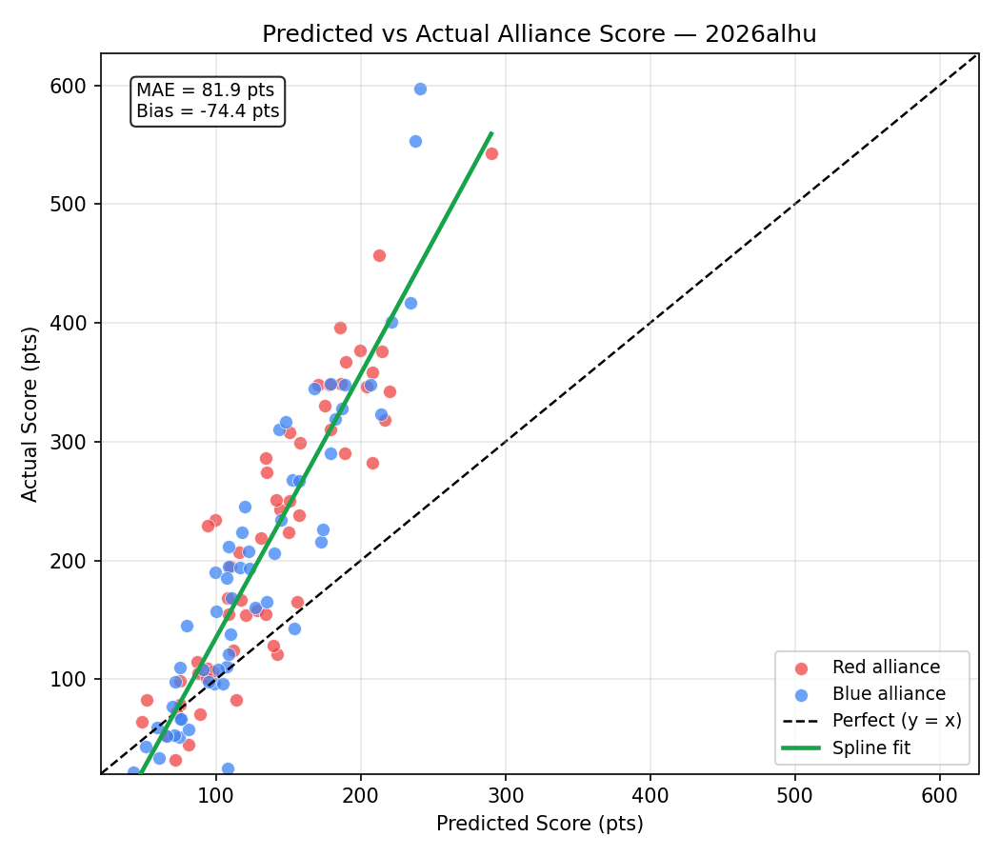

# Event Preview — Rocket City Regional

**Event key:** `2026alhu`  
**Generated:** 2026-04-10  
**Status:** 57 of 80 matches played  
**Prediction accuracy (completed):** 51/57 = 89.5%  

> Scores are carry-forward estimates from prior events. Teams marked **Current** have live estimates computed from this event. Teams marked *(est. avg)* have no prior data and use the field median.

## Event Details

| Field | Value |
|:------|:------|
| Name | Rocket City Regional |
| Event Key | `2026alhu` |
| Week | Week 6 |
| Dates | 2026-04-08 – 2026-04-11 |
| Location | Huntsville, AL, USA |

## Team Information (49 teams)

| Rank | Team | Nickname | City | St | Score | Vol | Fuel Auto | Fuel Tlp | Tower Auto | Tower EG | Penalty | Defend | Last Seen |
|-----:|-----:|:---------|:-----|:---|------:|----:|----------:|---------:|-----------:|---------:|--------:|-------:|:----------|
| 1 | 2481 | Roboteers | Tremont | Illinois | 138.4 | 44.9 | 44.2 | 97.8 | 0.0 | 0.0 | 3.5 | 0.0 | Current |
| 2 | 9401 | Midas' Mayhem | Troy | Missouri | 100.0 | 44.9 | 26.3 | 73.7 | 0.0 | 0.0 | 0.0 | 0.0 | Current |
| 3 | 4020 | Cyber Tribe | Kingsport | Tennessee | 93.1 | 44.9 | 27.8 | 67.1 | 0.0 | 0.0 | 1.7 | 0.0 | Current |
| 4 | 2783 | Engineers of Tomorrow | La Grange | Kentucky | 92.3 | 44.9 | 20.9 | 70.5 | 0.0 | 1.0 | 0.0 | 0.0 | Current |
| 5 | 2638 | Rebel Robotics | Great Neck | New York | 89.0 | 44.9 | 24.5 | 68.1 | 0.0 | 0.7 | 4.3 | 0.0 | Current |
| 6 | 5740 | Trojanators | Cranberry Township | Pennsylvania | 85.8 | 44.9 | 22.9 | 62.9 | 0.0 | 0.0 | 0.0 | 0.0 | Current |
| 7 | 2393 | Robotichauns | Knoxville | Tennessee | 78.4 | 44.9 | 19.6 | 63.3 | 0.0 | 1.0 | 5.6 | 0.0 | Current |
| 8 | 2556 | RadioActive Roaches | Niceville | Florida | 66.9 | 44.9 | 15.1 | 63.2 | 0.0 | 0.0 | 11.4 | 0.0 | Current |
| 9 | 3966 | Gryphon Command | Knoxville | Tennessee | 66.1 | 44.9 | 16.9 | 51.5 | 0.0 | 0.0 | 2.3 | 0.0 | Current |
| 10 | 4504 | B. C. Robotics | Maryville | Tennessee | 64.6 | 44.9 | 11.7 | 52.9 | 0.0 | 0.0 | 0.0 | 0.0 | Current |
| 11 | 3959 | Mech Tech | Somerville | Alabama | 62.5 | 44.9 | 17.4 | 50.3 | 0.0 | 0.0 | 5.3 | 0.0 | Current |
| 12 | 1912 | Team Combustion | Slidell | Louisiana | 61.6 | 44.9 | 6.9 | 54.7 | 0.0 | 0.0 | 0.0 | 0.0 | Current |
| 13 | 6517 | So-Kno Robo | Knoxville | Tennessee | 55.0 | 44.9 | 12.0 | 43.0 | 0.0 | 0.0 | 0.0 | 0.0 | Current |
| 14 | 744 | Shark Attack | Fort Lauderdale | Florida | 54.0 | 44.9 | 5.5 | 48.9 | 0.0 | 0.0 | 0.3 | 0.0 | Current |
| 15 | 120 | Youth Tech Academy Red Dragons | Cleveland | Ohio | 52.3 | 44.9 | 5.2 | 47.1 | 0.0 | 0.0 | 0.0 | 0.0 | Current |
| 16 | 11173 | STAR FORCE | Chicago | Illinois | 51.7 | 44.9 | 9.9 | 44.4 | 0.0 | 0.0 | 2.5 | 0.0 | Current |
| 17 | 3492 | Putnam Area Robotics Team (P.A.R.T.s) | Winfield | West Virginia | 51.7 | 44.9 | 10.4 | 41.2 | 0.0 | 0.0 | 0.0 | 0.0 | Current |
| 18 | 1466 | Webb Robotics | Knoxville | Tennessee | 51.5 | 44.9 | 9.9 | 41.6 | 0.0 | 0.0 | 0.0 | 0.0 | Current |
| 19 | 9067 | The Goonies | Searcy | Arkansas | 44.6 | 44.9 | 11.0 | 33.7 | 0.0 | 0.0 | 0.0 | 0.0 | Current |
| 20 | 7515 | Dark Side Robotics | Williamstown | West Virginia | 42.4 | 44.9 | 7.5 | 25.4 | 4.1 | 5.4 | 0.0 | 0.0 | Current |
| 21 | 3201 | Ross Rambotics | Hamilton | Ohio | 39.2 | 44.9 | 10.8 | 30.3 | 0.0 | 0.0 | 2.0 | 0.0 | Current |
| 22 | 7111 | RAD Robotics | Huntsville | Alabama | 38.7 | 44.9 | 13.1 | 31.6 | 0.0 | 0.0 | 6.0 | 1.4 | Current |
| 23 | 11037 | Clarksville Cyber Storm | Clarksville | Tennessee | 37.7 | 44.9 | 11.8 | 25.9 | 0.0 | 0.0 | 0.0 | 0.0 | Current |
| 24 | 4150 | FRobotics | Murrysville | Pennsylvania | 34.5 | 44.9 | 9.8 | 24.7 | 0.0 | 0.0 | 0.0 | 0.0 | Current |
| 25 | 3260 | SHARP | Pittsburgh | Pennsylvania | 33.3 | 44.9 | 8.6 | 24.6 | 0.0 | 0.0 | 0.0 | 0.0 | Current |
| 26 | 4107 | Team Storm | Long Beach | Mississippi | 32.9 | 44.9 | 5.9 | 31.4 | 0.0 | 0.0 | 4.4 | 0.0 | Current |
| 27 | 10137 | RoboKats | Lexington | Kentucky | 31.9 | 44.9 | 5.7 | 26.2 | 0.0 | 0.0 | 0.0 | 0.0 | Current |
| 28 | 3792 | Army Ants | Columbia | Missouri | 31.9 | 44.9 | 2.4 | 32.4 | 0.0 | 0.0 | 2.9 | 0.0 | Current |
| 29 | 9153 | Bearcat Robotics | Ruston | Louisiana | 29.8 | 44.9 | 8.4 | 17.9 | 0.0 | 3.5 | 0.0 | 0.0 | Current |
| 30 | 34 | Rockets | Athens | Alabama | 29.2 | 44.9 | 5.1 | 29.2 | 0.0 | 0.0 | 5.1 | 0.0 | Current |
| 31 | 5002 | Dragon Robotics | Collierville | Tennessee | 29.0 | 44.9 | 7.6 | 21.4 | 0.0 | 0.0 | 0.0 | 0.0 | Current |
| 32 | 7525 | Pioneers | Nashville | Tennessee | 28.6 | 44.9 | 10.2 | 27.0 | 0.0 | 0.0 | 8.6 | 0.0 | Current |
| 33 | 4265 | Secret City Wildbots | Oak Ridge | Tennessee | 27.6 | 44.9 | 5.2 | 26.3 | 0.0 | 0.0 | 4.0 | 0.0 | Current |
| 34 | 5842 | Royal Robotics | New Port Richey | Florida | 27.0 | 44.9 | 1.8 | 25.3 | 0.0 | 0.0 | 0.0 | 0.0 | Current |
| 35 | 8778 | HSUWerx | Fort Walton Beach | Florida | 26.1 | 14.8 | 3.4 | 20.5 | 0.0 | 2.2 | 0.0 | 0.0 | Wk3 Smoky Mountains Regi |
| 36 | 10961 | Hyper Wave | Gulf Shores | Alabama | 24.7 | 44.9 | 7.0 | 22.0 | 0.0 | 0.0 | 4.3 | 0.0 | Current |
| 37 | 1308 | Wildcat Robotics | Cleveland | Ohio | 24.6 | 44.9 | 4.1 | 24.1 | 0.0 | 0.0 | 3.6 | 0.0 | Current |
| 38 | 538 | Renaissance Robotics | Athens | Alabama | 24.1 | 44.9 | 8.1 | 24.1 | 0.0 | 0.0 | 8.2 | 0.0 | Current |
| 39 | 4306 | Robokomodos | Franklin | Tennessee | 24.0 | 44.9 | 3.1 | 20.9 | 0.0 | 0.0 | 0.0 | 0.0 | Current |
| 40 | 5492 | Winner's Circle Robo Jockey's | Louisville | Kentucky | 23.3 | 44.9 | 4.9 | 17.7 | 0.0 | 0.7 | 0.0 | 0.0 | Current |
| 41 | 8624 | Sasquatch Robotics | Andalusia | Alabama | 20.6 | 44.9 | 8.6 | 13.8 | 0.0 | 0.0 | 1.8 | 0.0 | Current |
| 42 | 7428 | Gigawatts | Fort Payne | Alabama | 17.9 | 44.9 | 6.3 | 11.6 | 0.0 | 0.0 | 0.0 | 0.0 | Current |
| 43 | 3140 | Flagship | Knoxville | Tennessee | 17.0 | 44.9 | 7.9 | 16.0 | 0.0 | 0.0 | 6.8 | 0.0 | Current |
| 44 | 5045 | SpartaBot | Memphis | Tennessee | 17.0 | 44.9 | 5.3 | 15.0 | 0.0 | 0.0 | 3.3 | 0.0 | Current |
| 45 | 7917 | Frontier | Nashville | Tennessee | 15.8 | 44.9 | 3.8 | 15.1 | 0.0 | 0.0 | 3.1 | 0.0 | Current |
| 46 | 6107 | CyberJagzz | Huntsville | Alabama | 13.2 | 44.9 | 0.0 | 13.2 | 0.0 | 0.0 | 0.0 | 0.0 | Current |
| 47 | 5125 | Hawks on the Horizon | Chicago | Illinois | 12.9 | 44.9 | 2.0 | 10.8 | 0.0 | 0.0 | 0.0 | 0.0 | Current |
| 48 | 3984 | Topper Robotics | Johnson City | Tennessee | 7.9 | 44.9 | 5.4 | 4.3 | 0.0 | 0.0 | 1.8 | 0.0 | Current |
| 49 | 2973 | Mad Rockers | Madison | Alabama | 5.8 | 44.9 | 0.0 | 5.8 | 0.0 | 0.0 | 0.0 | 0.0 | Current |

## Completed Matches — Predictions vs Actuals (57 played, accuracy: 51/57 = 89.5%)

| Match | Red Alliance | Blue Alliance | Pred Red | Pred Blue | Win% Red | Act Red | Act Blue | Winner | Correct |
|:------|:-------------|:--------------|----------:|----------:|---------:|--------:|---------:|:------:|:-------:|
| QM1 | 2481(1) / 538 / 4306 | 6517 / 9067 / 3984 | 187 | 108 | 76% | 349 | 111 | 🔴 RED | ✅ |
| QM2 | 9401(2) / 1466 / 11037 | 2783(4) / 2556(8) / 5492 | 189 | 182 | 52% | 290 | 319 | 🔵 BLUE | ❌ |
| QM3 | 11173 / 4107 / 4265 | 3792 / 9153 / 5125 | 112 | 75 | 63% | 124 | 51 | 🔴 RED | ✅ |
| QM4 | 744 / 10961 / **3140** | 5740(6) / 4150 / 1308 | 96 | 145 | 33% | 101 | 234 | 🔵 BLUE | ✅ |
| QM5 | 5002 / 8624 / 7917 | 1912 / 34 / 7428 | 65 | 109 | 35% | 53 | 121 | 🔵 BLUE | ✅ |
| QM6 | 3959 / 3492 / 5045 | 4020(3) / 2393(7) / 7515 | 131 | 214 | 23% | 219 | 323 | 🔵 BLUE | ✅ |
| QM7 | 3201 / 5842 / 2973 | 7111 / 10137 / 7525 | 72 | 99 | 40% | 32 | 190 | 🔵 BLUE | ✅ |
| QM8 | 2638(5) / 3966(9) / 4504 | 120 / 3260 / 6107 | 220 | 99 | 86% | 342 | 96 | 🔴 RED | ✅ |
| QM9 | 2783(4) / 4265 / 538 | 744 / 11173 / 4150 | 144 | 140 | 51% | 243 | 206 | 🔴 RED | ✅ |
| QM10 | 11037 / 1308 / 5125 | 3792 / 8624 / 3984 | 75 | 60 | 55% | 79 | 34 | 🔴 RED | ✅ |
| QM11 | 9401(2) / 2393(7) / 9153 | 2481(1) / 1466 / 9067 | 208 | 235 | 41% | 282 | 417 | 🔵 BLUE | ✅ |
| QM12 | 5740(6) / 1912 / 7515 | 2556(8) / 5842 / 5045 | 190 | 111 | 76% | 367 | 168 | 🔴 RED | ✅ |
| QM13 | 2638(5) / 120 / 5002 | 3959 / 10137 / 7917 | 170 | 110 | 71% | 348 | 138 | 🔴 RED | ✅ |
| QM14 | 4020(3) / 4504 / 6517 | 34 / 7525 / **3140** | 213 | 75 | 89% | 457 | 110 | 🔴 RED | ✅ |
| QM15 | 3492 / 3260 / 5492 | 4306 / 6107 / 2973 | 108 | 43 | 72% | 168 | 22 | 🔴 RED | ✅ |
| QM17 | 2393(7) / 5125 / 3984 | 9401(2) / 2556(8) / 744 | 99 | 221 | 13% | 234 | 401 | 🔵 BLUE | ✅ |
| QM18 | 3959 / 5842 / 8624 | 9153 / 538 / 7917 | 110 | 70 | 64% | 195 | 77 | 🔴 RED | ✅ |
| QM19 | 7515 / 4150 / **3140** | 2638(5) / 1466 / 10137 | 94 | 172 | 24% | 109 | 216 | 🔵 BLUE | ✅ |
| QM20 | 2783(4) / 11173 / 6107 | 5740(6) / 6517 / 3260 | 157 | 174 | 44% | 238 | 226 | 🔴 RED | ❌ |
| QM21 | 3966(9) / 5045 / 2973 | 34 / 4265 / 4306 | 89 | 81 | 53% | 71 | 58 | 🔴 RED | ✅ |
| QM22 | 4020(3) / 4107 / 10961 | 2481(1) / 4504 / 11037 | 151 | 241 | 21% | 308 | 597 | 🔵 BLUE | ✅ |
| QM23 | 5002 / 7525 / 5492 | 3492 / 7111 / 3792 | 81 | 122 | 35% | 45 | 208 | 🔵 BLUE | ✅ |
| QM24 | 9067 / 1308 / 7428 | 1912 / 120 / 3201 | 87 | 153 | 27% | 115 | 268 | 🔵 BLUE | ✅ |
| QM25 | 2783(4) / 2393(7) / 3260 | 7515 / 7917 / 5125 | 204 | 71 | 89% | 346 | 53 | 🔴 RED | ✅ |
| QM26 | 4306 / **3140** / 3984 | 11173 / 9153 / 5842 | 49 | 109 | 29% | 64 | 195 | 🔵 BLUE | ✅ |
| QM27 | 5740(6) / 1466 / 6107 | 11037 / 4107 / 538 | 150 | 95 | 69% | 224 | 98 | 🔴 RED | ✅ |
| QM28 | 2638(5) / 7525 / 5045 | 2556(8) / 3492 / 10961 | 135 | 143 | 47% | 286 | 310 | 🔵 BLUE | ✅ |
| QM29 | 9067 / 3201 / 3792 | 4504 / 8624 / 2973 | 116 | 91 | 59% | 207 | 108 | 🔴 RED | ✅ |
| QM30 | 2481(1) / 10137 / 34 | 1912 / 744 / 7111 | 200 | 154 | 66% | 377 | 143 | 🔴 RED | ✅ |
| QM31 | 9401(2) / 4020(3) / 5492 | 120 / 4150 / 7428 | 216 | 105 | 84% | 318 | 96 | 🔴 RED | ✅ |
| QM32 | 3966(9) / 3959 / 4265 | 6517 / 5002 / 1308 | 156 | 109 | 67% | 165 | 212 | 🔵 BLUE | ❌ |
| QM33 | 7525 / 7917 / 3984 | 11037 / **3140** / 5045 | 52 | 72 | 43% | 83 | 98 | 🔵 BLUE | ✅ |
| QM34 | 5740(6) / 3792 / 538 | 2638(5) / 2393(7) / 3201 | 142 | 207 | 28% | 251 | 348 | 🔵 BLUE | ✅ |
| QM35 | 2783(4) / 744 / 10137 | 9067 / 4107 / 4306 | 178 | 102 | 76% | 348 | 108 | 🔴 RED | ✅ |
| QM36 | 1912 / 6107 / 5125 | 4020(3) / 4150 / 9153 | 88 | 157 | 26% | 105 | 267 | 🔵 BLUE | ✅ |
| QM37 | 2481(1) / 9401(2) / 3492 | 3959 / 34 / 1308 | 290 | 116 | 94% | 543 | 194 | 🔴 RED | ✅ |
| QM38 | 3966(9) / 3260 / 5002 | 5842 / 10961 / 5492 | 128 | 75 | 69% | 158 | 67 | 🔴 RED | ✅ |
| QM39 | 2556(8) / 120 / 7111 | 6517 / 11173 / 8624 | 158 | 127 | 61% | 299 | 160 | 🔴 RED | ✅ |
| QM40 | 1466 / 7428 / 2973 | 4504 / 7515 / 4265 | 75 | 135 | 29% | 99 | 165 | 🔵 BLUE | ✅ |
| QM41 | 2638(5) / 744 / 3792 | 4020(3) / 1912 / 4306 | 175 | 179 | 49% | 330 | 290 | 🔴 RED | ❌ |
| QM42 | 2783(4) / 5740(6) / 9153 | 3492 / 10137 / 1308 | 208 | 108 | 82% | 358 | 25 | 🔴 RED | ✅ |
| QM43 | 9067 / 34 / 5492 | 3959 / 10961 / 5125 | 97 | 100 | 49% | 107 | 157 | 🔵 BLUE | ✅ |
| QM44 | 2556(8) / 4150 / 7917 | 2481(1) / 3966(9) / 4107 | 117 | 237 | 14% | 167 | 553 | 🔵 BLUE | ✅ |
| QM45 | 11173 / 1466 / 3201 | 5002 / 5045 / 6107 | 142 | 59 | 78% | 121 | 59 | 🔴 RED | ✅ |
| QM46 | 2393(7) / 6517 / 120 | 11037 / 3984 / 2973 | 186 | 51 | 89% | 396 | 43 | 🔴 RED | ✅ |
| QM47 | 4504 / 7525 / 5842 | 9401(2) / 4265 / 8624 | 120 | 148 | 40% | 154 | 317 | 🔵 BLUE | ✅ |
| QM48 | 7515 / 3260 / 7428 | 7111 / 538 / **3140** | 94 | 80 | 55% | 101 | 145 | 🔵 BLUE | ❌ |
| QM49 | 4020(3) / 9067 / 5125 | 5740(6) / 3966(9) / 7917 | 151 | 168 | 44% | 250 | 345 | 🔵 BLUE | ✅ |
| QM50 | 2556(8) / 3201 / 34 | 2783(4) / 3959 / 3792 | 135 | 187 | 32% | 274 | 328 | 🔵 BLUE | ✅ |
| QM51 | 2481(1) / 11173 / 1308 | 2638(5) / 5492 / 2973 | 215 | 118 | 81% | 376 | 224 | 🔴 RED | ✅ |
| QM52 | 6517 / 1466 / 4107 | 9401(2) / 1912 / 5842 | 139 | 189 | 33% | 128 | 348 | 🔵 BLUE | ✅ |
| QM53 | 7515 / 11037 / 7525 | 744 / 5002 / 4306 | 109 | 107 | 51% | 155 | 185 | 🔵 BLUE | ❌ |
| QM54 | 4504 / 3492 / 7428 | 4150 / 3260 / 3984 | 134 | 76 | 70% | 155 | 67 | 🔴 RED | ✅ |
| QM55 | 120 / 10137 / 9153 | 10961 / 538 / 5045 | 114 | 66 | 67% | 83 | 52 | 🔴 RED | ✅ |
| QM56 | 7111 / 8624 / 6107 | 2393(7) / 4265 / **3140** | 73 | 123 | 32% | 72 | 193 | 🔵 BLUE | ✅ |
| QM57 | 3966(9) / 1912 / 1466 | 3959 / 11173 / 2973 | 179 | 120 | 70% | 310 | 245 | 🔴 RED | ✅ |
| QM58 | 6517 / 5492 / 7917 | 5740(6) / 744 / 3201 | 94 | 179 | 22% | 229 | 349 | 🔵 BLUE | ✅ |

## Upcoming Matches — Predictions (23 remaining)

| Match | Red Alliance | Blue Alliance | Pred Red | Pred Blue | Win% Red | Favored |
|:------|:-------------|:--------------|----------:|----------:|---------:|:--------|
| QM16 | 7111 / 4107 / 7428 | 3966(9) / 3201 / 10961 | 90 | 130 | 36% | 🔵 BLUE |
| QM59 | 11037 / 3260 / 3792 | 3492 / 9067 / 4150 | 103 | 131 | 40% | 🔵 BLUE |
| QM60 | 7515 / 9153 / 34 | 120 / 4107 / 7525 | 101 | 114 | 46% | EVEN |
| QM61 | 9401(2) / 7111 / 5045 | 2638(5) / 538 / 5125 | 156 | 126 | 61% | 🔴 RED |
| QM62 | 4504 / **3140** / 6107 | 2481(1) / 2783(4) / 5002 | 95 | 260 | 7% | 🔵 BLUE |
| QM63 | 5842 / 1308 / 4306 | 2393(7) / 2556(8) / 7428 | 76 | 163 | 21% | 🔵 BLUE |
| QM64 | 10137 / 10961 / 8624 | 4020(3) / 4265 / 3984 | 77 | 129 | 32% | 🔵 BLUE |
| QM65 | 11173 / 9067 / 7917 | 3492 / 1466 / 7525 | 112 | 132 | 43% | 🔵 BLUE |
| QM66 | 6517 / 11037 / 34 | 2638(5) / 3260 / 9153 | 122 | 152 | 39% | 🔵 BLUE |
| QM67 | 4504 / 1912 / 538 | 3966(9) / 5492 / 5125 | 150 | 102 | 67% | 🔴 RED |
| QM68 | 744 / 4107 / 5045 | 1308 / **3140** / 2973 | 104 | 47 | 70% | 🔴 RED |
| QM69 | 2481(1) / 3201 / 4265 | 9401(2) / 120 / 7515 | 205 | 195 | 54% | EVEN |
| QM70 | 4150 / 5002 / 10961 | 2393(7) / 4306 / 8624 | 88 | 123 | 38% | 🔵 BLUE |
| QM71 | 2556(8) / 3792 / 6107 | 10137 / 5842 / 7428 | 112 | 77 | 62% | 🔴 RED |
| QM72 | 4020(3) / 5740(6) / 3959 | 2783(4) / 7111 / 3984 | 241 | 139 | 82% | 🔴 RED |
| QM73 | 744 / 1308 / 538 | 4504 / 1466 / 3260 | 103 | 149 | 34% | 🔵 BLUE |
| QM74 | 120 / 3492 / 4265 | 1912 / 4107 / **3140** | 132 | 112 | 57% | 🔴 RED |
| QM75 | 4150 / 5492 / 8624 | 6517 / 7515 / 5045 | 78 | 114 | 37% | 🔵 BLUE |
| QM76 | 3792 / 10961 / 2973 | 9401(2) / 7917 / 6107 | 62 | 129 | 27% | 🔵 BLUE |
| QM77 | 5002 / 5842 / 3984 | 2783(4) / 2638(5) / 9067 | 64 | 226 | 7% | 🔵 BLUE |
| QM78 | 2556(8) / 9153 / 4306 | 4020(3) / 3201 / 7111 | 121 | 171 | 32% | 🔵 BLUE |
| QM79 | 5740(6) / 7525 / 5125 | 2481(1) / 3959 / 7428 | 127 | 219 | 20% | 🔵 BLUE |
| QM80 | 2393(7) / 11037 / 10137 | 3966(9) / 11173 / 34 | 148 | 147 | 50% | EVEN |

## Team 3140 — Flagship (Rank 43)

| Match | Time | Alliance | Partners | Opponent Alliance | Prediction | Result | Correct |
|:------|:-----|:--------:|:---------|:------------------|:-----------|:-------|:-------:|
| QM4 | Fri@9:15am | RED | 744 / 10961 | 5740(6) / 4150 / 1308 | L 96–145 33% | 🔴 Loss 101–234 | ✅ |
| QM14 | Fri@10:38am | BLUE | 34 / 7525 | 4020(3) / 4504 / 6517 | L 75–213 11% | 🔴 Loss 110–457 | ✅ |
| QM19 | Fri@11:22am | RED | 7515 / 4150 | 2638(5) / 1466 / 10137 | L 94–172 24% | 🔴 Loss 109–216 | ✅ |
| QM26 | Fri@1:25pm | RED | 4306 / 3984 | 11173 / 9153 / 5842 | L 49–109 29% | 🔴 Loss 64–195 | ✅ |
| QM33 | Fri@2:21pm | BLUE | 11037 / 5045 | 7525 / 7917 / 3984 | W 72–52 57% | 🟢 Win 98–83 | ✅ |
| QM48 | Fri@4:27pm | BLUE | 7111 / 538 | 7515 / 3260 / 7428 | L 80–94 45% | 🟢 Win 145–101 | ❌ |
| QM56 | Fri@5:31pm | BLUE | 2393(7) / 4265 | 7111 / 8624 / 6107 | W 123–73 68% | 🟢 Win 193–72 | ✅ |
| QM62 | ~Sat@9:17am | RED | 4504 / 6107 | 2481(1) / 2783(4) / 5002 | L 95–260 7% | — | — |
| QM68 | ~Sat@10:10am | BLUE | 1308 / 2973 | 744 / 4107 / 5045 | L 47–104 30% | — | — |
| QM74 | ~Sat@11:01am | BLUE | 1912 / 4107 | 120 / 3492 / 4265 | L 112–132 43% | — | — |

## Prediction Statistics

### Score Prediction Accuracy

Based on **57 completed matches** (114 alliance-score observations).

| Metric | Value |
|:-------|------:|
| Mean Absolute Error (MAE) | 81.9 pts |
| Root Mean Squared Error (RMSE) | 108.4 pts |
| Mean Bias (pred − actual) | -74.4 pts |
| Win prediction accuracy | 51/57 = 89.5% |

### Predicted vs Actual Score by Actual Score Range

| Actual Score Range | Matches | Avg Predicted | Avg Actual | Avg Error | Abs Error |
|:-------------------|--------:|--------------:|-----------:|----------:|----------:|
| 0–50 | 6 | 69 | 34 | +36 | 36 |
| 50–100 | 20 | 77 | 74 | +3 | 14 |
| 100–150 | 17 | 105 | 117 | -13 | 18 |
| 150–200 | 17 | 118 | 172 | -54 | 54 |
| 200–250 | 15 | 133 | 224 | -92 | 92 |
| 250–300 | 10 | 161 | 276 | -115 | 115 |
| 300–350 | 18 | 183 | 333 | -149 | 149 |
| 350–400 | 5 | 200 | 375 | -175 | 175 |
| 400–450 | 2 | 228 | 409 | -181 | 181 |
| 450–500 | 1 | 213 | 457 | -244 | 244 |
| 500–550 | 1 | 290 | 543 | -253 | 253 |
| 550–600 | 2 | 239 | 575 | -336 | 336 |

### Win Prediction Calibration

Rows grouped by the predicted confidence for the favored alliance.

| Confidence Band | Matches | Correct | Accuracy |
|:----------------|--------:|--------:|---------:|
| 50–60% | 15 | 10 | 67% |
| 60–70% | 15 | 14 | 93% |
| 70–80% | 17 | 17 | 100% |
| 80–90% | 9 | 9 | 100% |
| 90–100% | 1 | 1 | 100% |
