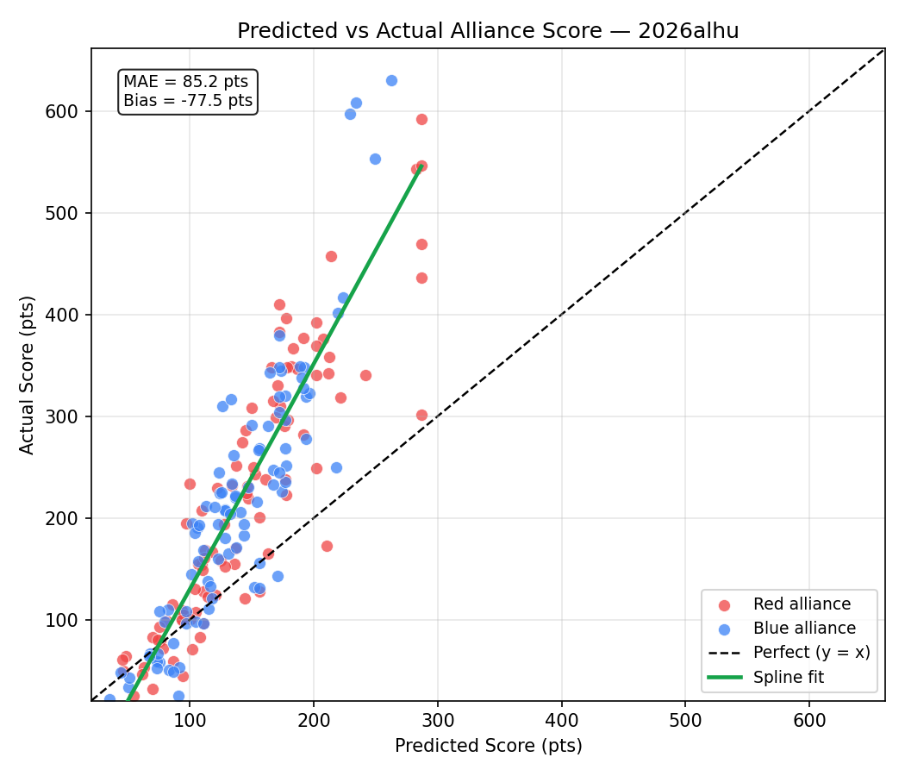

# Event Preview — Rocket City Regional

**Event key:** `2026alhu`  
**Generated:** 2026-04-12  
**Status:** 94 of 95 matches played  
**Prediction accuracy (completed):** 82/94 = 87.2%  

> Scores are carry-forward estimates from prior events. Teams marked **Current** have live estimates computed from this event. Teams marked *(est. avg)* have no prior data and use the field median.

## Event Details

| Field | Value |
|:------|:------|
| Name | Rocket City Regional |
| Event Key | `2026alhu` |
| Week | Week 6 |
| Dates | 2026-04-08 – 2026-04-11 |
| Location | Huntsville, AL, USA |

## Team Information (48 teams)

| Rank | Team | Nickname | City | St | Score | Vol | Fuel Auto | Fuel Tlp | Tower Auto | Tower EG | Penalty | Defend | Last Seen |
|-----:|-----:|:---------|:-----|:---|------:|----:|----------:|---------:|-----------:|---------:|--------:|-------:|:----------|
| 1 | 2481 | Roboteers | Tremont | Illinois | 137.5 | 47.6 | 43.1 | 98.8 | 0.0 | 0.0 | 4.5 | 0.0 | Current |
| 2 | 2783 | Engineers of Tomorrow | La Grange | Kentucky | 96.5 | 47.6 | 20.8 | 75.0 | 0.0 | 0.6 | 0.0 | 0.0 | Current |
| 3 | 9401 | Midas' Mayhem | Troy | Missouri | 96.3 | 47.6 | 25.7 | 75.0 | 0.0 | 0.0 | 4.4 | 0.0 | Current |
| 4 | 4020 | Cyber Tribe | Kingsport | Tennessee | 90.7 | 47.6 | 27.2 | 65.8 | 0.0 | 0.0 | 2.2 | 0.0 | Current |
| 5 | 2638 | Rebel Robotics | Great Neck | New York | 84.4 | 47.6 | 24.5 | 62.1 | 0.0 | 1.2 | 3.5 | 0.0 | Current |
| 6 | 5740 | Trojanators | Cranberry Township | Pennsylvania | 82.3 | 47.6 | 21.1 | 61.2 | 0.0 | 0.0 | 0.0 | 0.0 | Current |
| 7 | 3959 | Mech Tech | Somerville | Alabama | 68.9 | 47.6 | 17.6 | 55.0 | 0.0 | 0.0 | 3.7 | 0.0 | Current |
| 8 | 3966 | Gryphon Command | Knoxville | Tennessee | 67.3 | 47.6 | 17.3 | 51.6 | 0.0 | 0.0 | 1.7 | 0.0 | Current |
| 9 | 6517 | So-Kno Robo | Knoxville | Tennessee | 63.1 | 47.6 | 15.5 | 47.2 | 0.5 | 0.0 | 0.0 | 0.0 | Current |
| 10 | 2556 | RadioActive Roaches | Niceville | Florida | 62.8 | 47.6 | 15.8 | 52.6 | 0.0 | 0.0 | 5.7 | 0.0 | Current |
| 11 | 2393 | Robotichauns | Knoxville | Tennessee | 61.6 | 47.6 | 15.4 | 47.3 | 0.0 | 0.6 | 1.8 | 0.0 | Current |
| 12 | 744 | Shark Attack | Fort Lauderdale | Florida | 60.4 | 47.6 | 7.5 | 53.7 | 0.0 | 0.0 | 0.8 | 0.0 | Current |
| 13 | 4504 | B. C. Robotics | Maryville | Tennessee | 60.2 | 47.6 | 11.3 | 48.9 | 0.0 | 0.0 | 0.0 | 0.0 | Current |
| 14 | 1912 | Team Combustion | Slidell | Louisiana | 57.1 | 47.6 | 4.7 | 52.4 | 0.0 | 0.0 | 0.0 | 0.0 | Current |
| 15 | 7111 | RAD Robotics | Huntsville | Alabama | 53.5 | 47.6 | 13.7 | 43.2 | 0.0 | 0.0 | 3.4 | 0.0 | Current |
| 16 | 120 | Youth Tech Academy Red Dragons | Cleveland | Ohio | 53.0 | 47.6 | 7.0 | 46.0 | 0.0 | 0.0 | 0.0 | 0.0 | Current |
| 17 | 11173 | STAR FORCE | Chicago | Illinois | 49.5 | 47.6 | 9.1 | 42.5 | 0.0 | 0.0 | 2.1 | 0.0 | Current |
| 18 | 3492 | Putnam Area Robotics Team (P.A.R.T.s) | Winfield | West Virginia | 48.6 | 47.6 | 12.1 | 36.5 | 0.0 | 0.0 | 0.0 | 0.0 | Current |
| 19 | 1466 | Webb Robotics | Knoxville | Tennessee | 48.5 | 47.6 | 11.3 | 37.2 | 0.0 | 0.0 | 0.0 | 0.0 | Current |
| 20 | 3201 | Ross Rambotics | Hamilton | Ohio | 46.1 | 47.6 | 12.6 | 35.9 | 0.0 | 0.0 | 2.4 | 0.0 | Current |
| 21 | 4107 | Team Storm | Long Beach | Mississippi | 44.2 | 47.6 | 6.2 | 39.7 | 0.0 | 0.0 | 1.7 | 0.0 | Current |
| 22 | 7515 | Dark Side Robotics | Williamstown | West Virginia | 44.1 | 47.6 | 10.1 | 25.9 | 2.9 | 5.3 | 0.0 | 0.0 | Current |
| 23 | 9067 | The Goonies | Searcy | Arkansas | 37.4 | 47.6 | 8.4 | 28.9 | 0.0 | 0.0 | 0.0 | 0.0 | Current |
| 24 | 5492 | Winner's Circle Robo Jockey's | Louisville | Kentucky | 34.5 | 47.6 | 5.3 | 28.7 | 0.5 | 0.0 | 0.0 | 0.0 | Current |
| 25 | 9153 | Bearcat Robotics | Ruston | Louisiana | 33.7 | 47.6 | 8.9 | 21.1 | 0.0 | 3.7 | 0.0 | 0.0 | Current |
| 26 | 34 | Rockets | Athens | Alabama | 33.0 | 47.6 | 5.6 | 31.9 | 0.0 | 0.0 | 4.5 | 0.0 | Current |
| 27 | 11037 | Clarksville Cyber Storm | Clarksville | Tennessee | 31.6 | 47.6 | 10.4 | 21.2 | 0.0 | 0.0 | 0.0 | 0.0 | Current |
| 28 | 7525 | Pioneers | Nashville | Tennessee | 31.1 | 47.6 | 7.9 | 28.2 | 0.0 | 0.0 | 5.0 | 0.0 | Current |
| 29 | 4150 | FRobotics | Murrysville | Pennsylvania | 30.7 | 47.6 | 7.5 | 23.2 | 0.0 | 0.0 | 0.0 | 0.0 | Current |
| 30 | 5045 | SpartaBot | Memphis | Tennessee | 29.6 | 47.6 | 9.4 | 23.5 | 0.0 | 0.0 | 3.4 | 0.0 | Current |
| 31 | 3260 | SHARP | Pittsburgh | Pennsylvania | 29.0 | 47.6 | 8.1 | 20.9 | 0.0 | 0.0 | 0.0 | 0.0 | Current |
| 32 | 538 | Renaissance Robotics | Athens | Alabama | 28.9 | 47.6 | 8.0 | 26.7 | 0.0 | 0.0 | 5.8 | 0.0 | Current |
| 33 | 5002 | Dragon Robotics | Collierville | Tennessee | 28.7 | 47.6 | 6.6 | 24.7 | 0.0 | 0.0 | 2.5 | 0.0 | Current |
| 34 | 7428 | Gigawatts | Fort Payne | Alabama | 27.4 | 47.6 | 6.9 | 20.5 | 0.0 | 0.0 | 0.0 | 0.0 | Current |
| 35 | 4265 | Secret City Wildbots | Oak Ridge | Tennessee | 27.0 | 47.6 | 7.0 | 24.2 | 0.0 | 0.0 | 4.2 | 0.0 | Current |
| 36 | 3792 | Army Ants | Columbia | Missouri | 26.1 | 47.6 | 3.7 | 24.5 | 0.0 | 0.0 | 2.1 | 0.0 | Current |
| 37 | 7917 | Frontier | Nashville | Tennessee | 24.0 | 47.6 | 4.0 | 21.6 | 0.5 | 0.0 | 2.1 | 0.0 | Current |
| 38 | 5125 | Hawks on the Horizon | Chicago | Illinois | 23.4 | 47.6 | 3.8 | 19.6 | 0.0 | 0.0 | 0.0 | 0.0 | Current |
| 39 | 10137 | RoboKats | Lexington | Kentucky | 21.4 | 47.6 | 5.0 | 16.4 | 0.0 | 0.0 | 0.0 | 0.0 | Current |
| 40 | 1308 | Wildcat Robotics | Cleveland | Ohio | 20.8 | 47.6 | 5.7 | 15.6 | 0.0 | 0.0 | 0.5 | 0.0 | Current |
| 41 | 3140 | Flagship | Knoxville | Tennessee | 18.6 | 47.6 | 8.3 | 15.2 | 0.0 | 0.0 | 4.9 | 0.0 | Current |
| 42 | 5842 | Royal Robotics | New Port Richey | Florida | 18.5 | 47.6 | 4.1 | 14.4 | 0.0 | 0.0 | 0.0 | 0.0 | Current |
| 43 | 4306 | Robokomodos | Franklin | Tennessee | 15.2 | 47.6 | 4.4 | 10.8 | 0.0 | 0.0 | 0.0 | 0.0 | Current |
| 44 | 6107 | CyberJagzz | Huntsville | Alabama | 14.7 | 47.6 | 0.0 | 14.7 | 0.0 | 0.0 | 0.0 | 0.0 | Current |
| 45 | 10961 | Hyper Wave | Gulf Shores | Alabama | 14.7 | 47.6 | 5.1 | 15.2 | 0.0 | 0.0 | 5.7 | 0.0 | Current |
| 46 | 3984 | Topper Robotics | Johnson City | Tennessee | 14.6 | 47.6 | 5.7 | 12.5 | 0.0 | 0.0 | 3.6 | 0.0 | Current |
| 47 | 8624 | Sasquatch Robotics | Andalusia | Alabama | 9.9 | 47.6 | 6.5 | 7.1 | 0.0 | 0.0 | 3.7 | 0.0 | Current |
| 48 | 2973 | Mad Rockers | Madison | Alabama | 5.0 | 47.6 | 0.3 | 4.7 | 0.0 | 0.0 | 0.0 | 0.0 | Current |

## Completed Matches — Predictions vs Actuals (94 played, accuracy: 82/94 = 87.2%)

| Match | Red Alliance | Blue Alliance | Pred Red | Pred Blue | Win% Red | Act Red | Act Blue | Winner | Correct |
|:------|:-------------|:--------------|----------:|----------:|---------:|--------:|---------:|:------:|:-------:|
| QM1 | 2481(1) / 538 / 4306 | 6517(9) / 9067 / 3984 | 182 | 115 | 72% | 349 | 111 | 🔴 RED | ✅ |
| QM2 | 9401(3) / 1466 / 11037 | 2783(2) / 2556 / 5492 | 176 | 194 | 44% | 290 | 319 | 🔵 BLUE | ✅ |
| QM3 | 11173 / 4107 / 4265 | 9153 / 3792 / 5125 | 121 | 83 | 63% | 124 | 51 | 🔴 RED | ✅ |
| QM4 | 744 / **3140** / 10961 | 5740(6) / 4150 / 1308 | 94 | 134 | 37% | 101 | 234 | 🔵 BLUE | ✅ |
| QM5 | 5002 / 7917 / 8624 | 1912 / 34 / 7428 | 63 | 118 | 32% | 53 | 121 | 🔵 BLUE | ✅ |
| QM6 | 3959(7) / 3492 / 5045 | 4020(4) / 2393 / 7515 | 147 | 196 | 34% | 219 | 323 | 🔵 BLUE | ✅ |
| QM7 | 3201 / 5842 / 2973 | 7111 / 7525 / 10137 | 70 | 106 | 38% | 32 | 190 | 🔵 BLUE | ✅ |
| QM8 | 2638(5) / 3966(8) / 4504 | 120 / 3260 / 6107 | 212 | 97 | 84% | 342 | 96 | 🔴 RED | ✅ |
| QM9 | 2783(2) / 538 / 4265 | 744 / 11173 / 4150 | 152 | 141 | 54% | 243 | 206 | 🔴 RED | ✅ |
| QM10 | 11037 / 5125 / 1308 | 3792 / 3984 / 8624 | 76 | 51 | 59% | 79 | 34 | 🔴 RED | ✅ |
| QM11 | 9401(3) / 2393 / 9153 | 2481(1) / 1466 / 9067 | 192 | 223 | 39% | 282 | 417 | 🔵 BLUE | ✅ |
| QM12 | 5740(6) / 1912 / 7515 | 2556 / 5045 / 5842 | 184 | 111 | 73% | 367 | 168 | 🔴 RED | ✅ |
| QM13 | 2638(5) / 120 / 5002 | 3959(7) / 7917 / 10137 | 166 | 114 | 67% | 348 | 138 | 🔴 RED | ✅ |
| QM14 | 4020(4) / 6517(9) / 4504 | 34 / 7525 / **3140** | 214 | 83 | 87% | 457 | 110 | 🔴 RED | ✅ |
| QM15 | 3492 / 5492 / 3260 | 4306 / 6107 / 2973 | 112 | 35 | 75% | 168 | 22 | 🔴 RED | ✅ |
| QM17 | 2393 / 5125 / 3984 | 9401(3) / 2556 / 744 | 100 | 220 | 15% | 234 | 401 | 🔵 BLUE | ✅ |
| QM18 | 3959(7) / 5842 / 8624 | 9153 / 538 / 7917 | 97 | 87 | 54% | 195 | 77 | 🔴 RED | ✅ |
| QM19 | 7515 / 4150 / **3140** | 2638(5) / 1466 / 10137 | 93 | 154 | 30% | 109 | 216 | 🔵 BLUE | ✅ |
| QM20 | 2783(2) / 11173 / 6107 | 5740(6) / 6517(9) / 3260 | 161 | 174 | 45% | 238 | 226 | 🔴 RED | ❌ |
| QM21 | 3966(8) / 5045 / 2973 | 34 / 4265 / 4306 | 102 | 75 | 59% | 71 | 58 | 🔴 RED | ✅ |
| QM22 | 4020(4) / 4107 / 10961 | 2481(1) / 4504 / 11037 | 150 | 229 | 25% | 308 | 597 | 🔵 BLUE | ✅ |
| QM23 | 5492 / 7525 / 5002 | 7111 / 3492 / 3792 | 94 | 128 | 39% | 45 | 208 | 🔵 BLUE | ✅ |
| QM24 | 9067 / 7428 / 1308 | 1912 / 120 / 3201 | 86 | 156 | 27% | 115 | 268 | 🔵 BLUE | ✅ |
| QM25 | 2783(2) / 2393 / 3260 | 7515 / 7917 / 5125 | 187 | 92 | 79% | 346 | 53 | 🔴 RED | ✅ |
| QM26 | **3140** / 4306 / 3984 | 11173 / 9153 / 5842 | 48 | 102 | 32% | 64 | 195 | 🔵 BLUE | ✅ |
| QM27 | 5740(6) / 1466 / 6107 | 4107 / 11037 / 538 | 146 | 105 | 64% | 224 | 98 | 🔴 RED | ✅ |
| QM28 | 2638(5) / 7525 / 5045 | 2556 / 3492 / 10961 | 145 | 126 | 56% | 286 | 310 | 🔵 BLUE | ❌ |
| QM29 | 3201 / 9067 / 3792 | 4504 / 8624 / 2973 | 110 | 75 | 62% | 207 | 108 | 🔴 RED | ✅ |
| QM30 | 2481(1) / 34 / 10137 | 744 / 1912 / 7111 | 192 | 171 | 57% | 377 | 143 | 🔴 RED | ✅ |
| QM31 | 9401(3) / 4020(4) / 5492 | 120 / 4150 / 7428 | 222 | 111 | 83% | 318 | 96 | 🔴 RED | ✅ |
| QM32 | 3959(7) / 3966(8) / 4265 | 6517(9) / 5002 / 1308 | 163 | 113 | 67% | 165 | 212 | 🔵 BLUE | ❌ |
| QM33 | 7525 / 7917 / 3984 | 11037 / 5045 / **3140** | 70 | 80 | 47% | 83 | 98 | 🔵 BLUE | ✅ |
| QM34 | 5740(6) / 538 / 3792 | 2638(5) / 2393 / 3201 | 137 | 192 | 32% | 251 | 348 | 🔵 BLUE | ✅ |
| QM35 | 2783(2) / 744 / 10137 | 4107 / 9067 / 4306 | 178 | 97 | 76% | 348 | 108 | 🔴 RED | ✅ |
| QM36 | 1912 / 5125 / 6107 | 4020(4) / 9153 / 4150 | 95 | 155 | 30% | 105 | 267 | 🔵 BLUE | ✅ |
| QM37 | 2481(1) / 9401(3) / 3492 | 3959(7) / 34 / 1308 | 282 | 123 | 91% | 543 | 194 | 🔴 RED | ✅ |
| QM38 | 3966(8) / 3260 / 5002 | 5492 / 5842 / 10961 | 125 | 68 | 69% | 158 | 67 | 🔴 RED | ✅ |
| QM39 | 2556 / 7111 / 120 | 6517(9) / 11173 / 8624 | 169 | 123 | 66% | 299 | 160 | 🔴 RED | ✅ |
| QM40 | 1466 / 7428 / 2973 | 4504 / 7515 / 4265 | 81 | 131 | 33% | 99 | 165 | 🔵 BLUE | ✅ |
| QM41 | 2638(5) / 744 / 3792 | 4020(4) / 1912 / 4306 | 171 | 163 | 53% | 330 | 290 | 🔴 RED | ✅ |
| QM42 | 2783(2) / 5740(6) / 9153 | 3492 / 10137 / 1308 | 212 | 91 | 85% | 358 | 25 | 🔴 RED | ✅ |
| QM43 | 9067 / 5492 / 34 | 3959(7) / 5125 / 10961 | 105 | 107 | 49% | 107 | 157 | 🔵 BLUE | ✅ |
| QM44 | 2556 / 4150 / 7917 | 2481(1) / 3966(8) / 4107 | 118 | 249 | 13% | 167 | 553 | 🔵 BLUE | ✅ |
| QM45 | 11173 / 1466 / 3201 | 5045 / 5002 / 6107 | 144 | 73 | 73% | 121 | 59 | 🔴 RED | ✅ |
| QM46 | 6517(9) / 2393 / 120 | 11037 / 3984 / 2973 | 178 | 51 | 86% | 396 | 43 | 🔴 RED | ✅ |
| QM47 | 4504 / 7525 / 5842 | 9401(3) / 4265 / 8624 | 110 | 133 | 42% | 154 | 317 | 🔵 BLUE | ✅ |
| QM48 | 7515 / 3260 / 7428 | 7111 / 538 / **3140** | 101 | 101 | 50% | 101 | 145 | 🔵 BLUE | ✅ |
| QM49 | 4020(4) / 9067 / 5125 | 5740(6) / 3966(8) / 7917 | 151 | 174 | 42% | 250 | 345 | 🔵 BLUE | ✅ |
| QM50 | 2556 / 3201 / 34 | 2783(2) / 3959(7) / 3792 | 142 | 191 | 34% | 274 | 328 | 🔵 BLUE | ✅ |
| QM51 | 2481(1) / 11173 / 1308 | 2638(5) / 5492 / 2973 | 208 | 124 | 76% | 376 | 224 | 🔴 RED | ✅ |
| QM52 | 6517(9) / 1466 / 4107 | 9401(3) / 1912 / 5842 | 156 | 172 | 45% | 128 | 348 | 🔵 BLUE | ✅ |
| QM53 | 7515 / 11037 / 7525 | 744 / 5002 / 4306 | 107 | 104 | 51% | 155 | 185 | 🔵 BLUE | ❌ |
| QM54 | 4504 / 3492 / 7428 | 4150 / 3260 / 3984 | 136 | 74 | 70% | 155 | 67 | 🔴 RED | ✅ |
| QM55 | 120 / 9153 / 10137 | 5045 / 538 / 10961 | 108 | 73 | 62% | 83 | 52 | 🔴 RED | ✅ |
| QM56 | 7111 / 6107 / 8624 | 2393 / 4265 / **3140** | 78 | 107 | 40% | 72 | 193 | 🔵 BLUE | ✅ |
| QM57 | 3966(8) / 1912 / 1466 | 3959(7) / 11173 / 2973 | 173 | 123 | 66% | 310 | 245 | 🔴 RED | ✅ |
| QM58 | 6517(9) / 5492 / 7917 | 5740(6) / 744 / 3201 | 122 | 189 | 28% | 229 | 349 | 🔵 BLUE | ✅ |
| QM59 | 11037 / 3260 / 3792 | 3492 / 9067 / 4150 | 87 | 117 | 40% | 59 | 133 | 🔵 BLUE | ✅ |
| QM60 | 7515 / 9153 / 34 | 120 / 4107 / 7525 | 111 | 128 | 44% | 96 | 207 | 🔵 BLUE | ✅ |
| QM61 | 9401(3) / 7111 / 5045 | 2638(5) / 538 / 5125 | 179 | 137 | 64% | 296 | 220 | 🔴 RED | ✅ |
| QM62 | 4504 / **3140** / 6107 | 2481(1) / 2783(2) / 5002 | 93 | 263 | 7% | 100 | 630 | 🔵 BLUE | ✅ |
| QM63 | 1308 / 5842 / 4306 | 2556 / 2393 / 7428 | 54 | 152 | 20% | 25 | 132 | 🔵 BLUE | ✅ |
| QM64 | 10137 / 10961 / 8624 | 4020(4) / 4265 / 3984 | 46 | 132 | 23% | 50 | 204 | 🔵 BLUE | ✅ |
| QM65 | 11173 / 9067 / 7917 | 3492 / 1466 / 7525 | 111 | 128 | 44% | 128 | 180 | 🔵 BLUE | ✅ |
| QM66 | 6517(9) / 34 / 11037 | 2638(5) / 9153 / 3260 | 128 | 147 | 43% | 194 | 230 | 🔵 BLUE | ✅ |
| QM67 | 4504 / 1912 / 538 | 3966(8) / 5492 / 5125 | 146 | 125 | 57% | 231 | 225 | 🔴 RED | ✅ |
| QM68 | 744 / 4107 / 5045 | 1308 / **3140** / 2973 | 134 | 44 | 78% | 232 | 48 | 🔴 RED | ✅ |
| QM69 | 2481(1) / 3201 / 4265 | 9401(3) / 120 / 7515 | 211 | 193 | 56% | 173 | 278 | 🔵 BLUE | ❌ |
| QM70 | 4150 / 5002 / 10961 | 2393 / 4306 / 8624 | 74 | 87 | 46% | 80 | 49 | 🔴 RED | ❌ |
| QM71 | 2556 / 3792 / 6107 | 7428 / 10137 / 5842 | 104 | 67 | 62% | 130 | 64 | 🔴 RED | ✅ |
| QM72 | 4020(4) / 5740(6) / 3959(7) | 2783(2) / 7111 / 3984 | 242 | 165 | 75% | 340 | 343 | 🔵 BLUE | ❌ |
| QM73 | 744 / 538 / 1308 | 4504 / 1466 / 3260 | 110 | 138 | 41% | 149 | 171 | 🔵 BLUE | ✅ |
| QM74 | 120 / 3492 / 4265 | 1912 / 4107 / **3140** | 129 | 120 | 53% | 152 | 211 | 🔵 BLUE | ❌ |
| QM75 | 5492 / 4150 / 8624 | 6517(9) / 7515 / 5045 | 75 | 137 | 30% | 93 | 222 | 🔵 BLUE | ✅ |
| QM76 | 3792 / 10961 / 2973 | 9401(3) / 7917 / 6107 | 46 | 135 | 22% | 61 | 262 | 🔵 BLUE | ✅ |
| QM77 | 5002 / 5842 / 3984 | 2783(2) / 2638(5) / 9067 | 62 | 218 | 9% | 46 | 250 | 🔵 BLUE | ✅ |
| QM78 | 2556 / 9153 / 4306 | 4020(4) / 7111 / 3201 | 112 | 190 | 25% | 161 | 338 | 🔵 BLUE | ✅ |
| QM79 | 5740(6) / 7525 / 5125 | 2481(1) / 3959(7) / 7428 | 137 | 234 | 20% | 170 | 608 | 🔵 BLUE | ✅ |
| QM80 | 2393 / 11037 / 10137 | 3966(8) / 11173 / 34 | 115 | 150 | 38% | 123 | 291 | 🔵 BLUE | ✅ |
| SF1M1 | 2481(1) / 9401(3) / 120 | 3959(7) / 744 / 3492 | 287 | 178 | 83% | 592 | 251 | 🔴 RED | ✅ |
| SF2M1 | 6517(9) / 4504 / 4107 | 5740(6) / 1912 / 9067 | 168 | 177 | 47% | 315 | 320 | 🔵 BLUE | ✅ |
| SF3M1 | 2783(2) / 4020(4) / 3984 | 2393 / 1466 / 3201 | 202 | 156 | 65% | 340 | 131 | 🔴 RED | ✅ |
| SF4M1 | 2638(5) / 3966(8) / 1308 | 2556 / 7111 / 7428 | 172 | 144 | 60% | 383 | 183 | 🔴 RED | ✅ |
| SF5M1 | 3959(7) / 744 / 3492 | 6517(9) / 4504 / 4107 | 178 | 168 | 54% | 223 | 233 | 🔵 BLUE | ❌ |
| SF6M1 | 2393 / 1466 / 3201 | 2556 / 7111 / 7428 | 156 | 144 | 54% | 201 | 194 | 🔴 RED | ✅ |
| SF7M1 | 2481(1) / 9401(3) / 120 | 5740(6) / 1912 / 9067 | 287 | 177 | 83% | 301 | 235 | 🔴 RED | ✅ |
| SF8M1 | 2783(2) / 4020(4) / 3984 | 2638(5) / 3966(8) / 1308 | 202 | 172 | 60% | 369 | 379 | 🔵 BLUE | ❌ |
| SF9M1 | 5740(6) / 1912 / 9067 | 2393 / 1466 / 3201 | 177 | 156 | 57% | 238 | 156 | 🔴 RED | ✅ |
| SF10M1 | 2783(2) / 4020(4) / 3984 | 6517(9) / 4504 / 4107 | 202 | 168 | 62% | 392 | 247 | 🔴 RED | ✅ |
| SF11M1 | 2481(1) / 9401(3) / 120 | 2638(5) / 3966(8) / 1308 | 287 | 172 | 84% | 546 | 245 | 🔴 RED | ✅ |
| SF12M1 | 2783(2) / 4020(4) / 3984 | 5740(6) / 1912 / 9067 | 202 | 177 | 59% | 249 | 268 | 🔵 BLUE | ❌ |
| SF13M1 | 2638(5) / 3966(8) / 1308 | 5740(6) / 1912 / 9067 | 172 | 177 | 49% | 410 | 296 | 🔴 RED | ❌ |
| F1M1 | 2481(1) / 9401(3) / 120 | 2638(5) / 3966(8) / 1308 | 287 | 172 | 84% | 469 | 304 | 🔴 RED | ✅ |
| F1M2 | 2481(1) / 9401(3) / 120 | 2638(5) / 3966(8) / 1308 | 287 | 172 | 84% | 436 | 319 | 🔴 RED | ✅ |

## Upcoming Matches — Predictions (1 remaining)

| Match | Red Alliance | Blue Alliance | Pred Red | Pred Blue | Win% Red | Favored |
|:------|:-------------|:--------------|----------:|----------:|---------:|:--------|
| QM16 | 7111 / 4107 / 7428 | 3966(8) / 3201 / 10961 | 125 | 128 | 49% | EVEN |

## Team 3140 — Flagship (Rank 41)

| Match | Time | Alliance | Partners | Opponent Alliance | Prediction | Result | Correct |
|:------|:-----|:--------:|:---------|:------------------|:-----------|:-------|:-------:|
| QM4 | Fri@9:15am | RED | 744 / 10961 | 5740(6) / 4150 / 1308 | L 94–134 37% | 🔴 Loss 101–234 | ✅ |
| QM14 | Fri@10:38am | BLUE | 34 / 7525 | 4020(4) / 6517(9) / 4504 | L 83–214 13% | 🔴 Loss 110–457 | ✅ |
| QM19 | Fri@11:22am | RED | 7515 / 4150 | 2638(5) / 1466 / 10137 | L 93–154 30% | 🔴 Loss 109–216 | ✅ |
| QM26 | Fri@1:25pm | RED | 4306 / 3984 | 11173 / 9153 / 5842 | L 48–102 32% | 🔴 Loss 64–195 | ✅ |
| QM33 | Fri@2:21pm | BLUE | 11037 / 5045 | 7525 / 7917 / 3984 | E 80–70 53% | 🟢 Win 98–83 | ❌ |
| QM48 | Fri@4:27pm | BLUE | 7111 / 538 | 7515 / 3260 / 7428 | E 101–101 50% | 🟢 Win 145–101 | ❌ |
| QM56 | Fri@5:31pm | BLUE | 2393 / 4265 | 7111 / 6107 / 8624 | W 107–78 60% | 🟢 Win 193–72 | ✅ |
| QM62 | Sat@9:12am | RED | 4504 / 6107 | 2481(1) / 2783(2) / 5002 | L 93–263 7% | 🔴 Loss 100–630 | ✅ |
| QM68 | Sat@10:06am | BLUE | 1308 / 2973 | 744 / 4107 / 5045 | L 44–134 22% | 🔴 Loss 48–232 | ✅ |
| QM74 | Sat@10:58am | BLUE | 1912 / 4107 | 120 / 3492 / 4265 | E 120–129 47% | 🟢 Win 211–152 | ❌ |

## Prediction Statistics

### Score Prediction Accuracy

Based on **94 completed matches** (188 alliance-score observations).

| Metric | Value |
|:-------|------:|
| Mean Absolute Error (MAE) | 85.2 pts |
| Root Mean Squared Error (RMSE) | 114.2 pts |
| Mean Bias (pred − actual) | -77.5 pts |
| Win prediction accuracy | 82/94 = 87.2% |

### Predicted vs Actual Score by Actual Score Range

| Actual Score Range | Matches | Avg Predicted | Avg Actual | Avg Error | Abs Error |
|:-------------------|--------:|--------------:|-----------:|----------:|----------:|
| 0–50 | 10 | 64 | 37 | +27 | 28 |
| 50–100 | 27 | 80 | 73 | +6 | 15 |
| 100–150 | 25 | 113 | 121 | -8 | 18 |
| 150–200 | 27 | 126 | 173 | -46 | 49 |
| 200–250 | 32 | 145 | 226 | -81 | 81 |
| 250–300 | 18 | 166 | 275 | -109 | 109 |
| 300–350 | 27 | 185 | 330 | -145 | 145 |
| 350–400 | 9 | 191 | 377 | -186 | 186 |
| 400–450 | 4 | 226 | 416 | -190 | 190 |
| 450–500 | 2 | 250 | 463 | -213 | 213 |
| 500–550 | 2 | 285 | 544 | -260 | 260 |
| 550–600 | 3 | 255 | 581 | -326 | 326 |
| 600–650 | 2 | 248 | 619 | -371 | 371 |

### Win Prediction Calibration

Rows grouped by the predicted confidence for the favored alliance.

| Confidence Band | Matches | Correct | Accuracy |
|:----------------|--------:|--------:|---------:|
| 50–60% | 33 | 23 | 70% |
| 60–70% | 27 | 26 | 96% |
| 70–80% | 19 | 18 | 95% |
| 80–90% | 12 | 12 | 100% |
| 90–100% | 3 | 3 | 100% |
