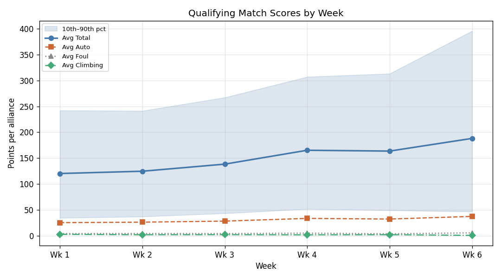
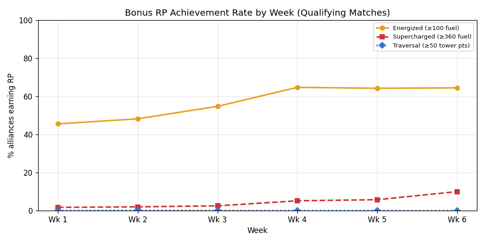
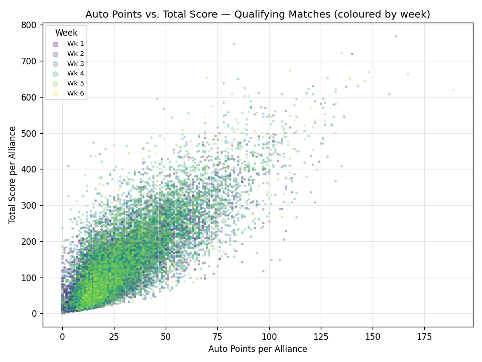

# Season 2026 — Event Summary

Generated 2026-04-07  |  158 events  |  read from local cache

Average scores are per-alliance (red or blue independently).

| Wk | Event Key | Event Name | Teams | Qual Matches | Qual Avg | Energized% | Supercharged% | Traversal% | Playoff Matches | Playoff Avg |
|---:|:----------|:-----------|------:|-------------:|---------:|-----------:|--------------:|-----------:|----------------:|------------:|
| 1 | 2026bcvi | Canadian Pacific Regional | 44 | 74 | 128.9 | 50.7% | 1.4% | 0.0% | 15 | 238.5 |
| 1 | 2026brba | Regional Brazil - Festival SESI de Educação | 48 | 72 | 103.0 | 37.5% | 0.0% | 0.7% | 15 | 167.9 |
| 1 | 2026cahal | CA District Half Moon Bay Event | 26 | 52 | 169.1 | 58.7% | 15.4% | 0.0% | 15 | 255.1 |
| 1 | 2026capoh | CA District Hueneme Port Event | 42 | 77 | 102.5 | 35.7% | 0.0% | 0.0% | 14 | 140.1 |
| 1 | 2026cosp | Pikes Peak Regional | 33 | 66 | 175.7 | 67.4% | 6.1% | 1.5% | 16 | 246.7 |
| 1 | 2026gadal | PCH District Dalton Event presented by Shaw Industries | 31 | 61 | 94.1 | 32.8% | 0.0% | 0.0% | 15 | 144.8 |
| 1 | 2026inmis | FIN District Mishawaka Event | 39 | 78 | 125.5 | 53.8% | 0.0% | 0.0% | 15 | 193.2 |
| 1 | 2026mabil | NE District Minuteman Event | 29 | 58 | 139.7 | 50.9% | 4.3% | 0.0% | 15 | 206.0 |
| 1 | 2026mefal | NE District Pine Tree Event | 26 | 40 | 171.9 | 61.3% | 6.2% | 0.0% | 15 | 194.9 |
| 1 | 2026miche | FIM District Chelsea Event presented by DTE | 39 | 77 | 147.0 | 68.2% | 0.0% | 0.0% | 15 | 237.0 |
| 1 | 2026milak | FIM District Lakeview Event | 39 | 76 | 111.1 | 45.4% | 1.3% | 0.0% | 16 | 185.7 |
| 1 | 2026mimtp | FIM District Mt Pleasant Event presented by AT&T | 40 | 80 | 102.8 | 38.1% | 0.0% | 0.0% | 15 | 177.2 |
| 1 | 2026mndu | Lake Superior Regional | 42 | 77 | 114.7 | 50.6% | 0.0% | 0.6% | 16 | 156.2 |
| 1 | 2026mndu2 | Northern Lights Regional | 42 | 76 | 97.7 | 33.6% | 0.7% | 0.0% | 16 | 159.4 |
| 1 | 2026mnwi | Minnesota Bluff Country Regional | 41 | 76 | 157.3 | 67.8% | 0.0% | 0.0% | 15 | 241.4 |
| 1 | 2026nccab | FNC District Cabarrus Event | 28 | 56 | 73.1 | 23.2% | 0.0% | 0.0% | 15 | 127.8 |
| 1 | 2026ncwak | FNC District Wake County Event #1 | 29 | 57 | 67.3 | 16.7% | 0.0% | 0.0% | 16 | 123.8 |
| 1 | 2026njwas | FMA District Warren Hills Event | 30 | 59 | 111.3 | 41.5% | 0.8% | 0.0% | 15 | 150.4 |
| 1 | 2026okok | Oklahoma Regional | 46 | 77 | 139.5 | 54.5% | 1.3% | 0.6% | 15 | 225.4 |
| 1 | 2026orsal | PNW District Oregon State Fair Event | 35 | 69 | 138.3 | 61.6% | 0.0% | 0.0% | 15 | 219.9 |
| 1 | 2026pahat | FMA District Hatboro-Horsham Event | 33 | 66 | 93.8 | 31.8% | 0.8% | 0.0% | 15 | 155.0 |
| 1 | 2026sccha | FSC District North Charleston Event presented by SCDE & City of North Charleston Recreation | 28 | 54 | 89.2 | 25.0% | 0.9% | 0.0% | 16 | 136.0 |
| 1 | 2026tuis | İstanbul Regional | 34 | 62 | 109.2 | 33.1% | 5.6% | 0.0% | 15 | 207.6 |
| 1 | 2026tuis2 | Bosphorus Regional | 36 | 66 | 125.4 | 55.3% | 0.0% | 0.0% | 15 | 179.1 |
| 1 | 2026txbel | FIT District Belton Event | 33 | 66 | 115.5 | 44.7% | 0.0% | 0.0% | 15 | 172.3 |
| 1 | 2026txcle | FIT District Space City @ League City Event #1 | 32 | 64 | 129.7 | 43.0% | 3.1% | 0.0% | 15 | 230.5 |
| 1 | 2026vaale | FCH District Alexandria VA Event presented by Qualcomm | 40 | 79 | 99.7 | 37.3% | 0.0% | 0.0% | 16 | 196.7 |
| 1 | 2026wabon | PNW District Bonney Lake Event | 34 | 68 | 128.8 | 51.5% | 1.5% | 0.0% | 16 | 192.8 |
| 1 | 2026wiply | WIN District Lakeland Event | 33 | 63 | 122.3 | 49.2% | 0.8% | 0.0% | 15 | 185.2 |
| 2 | 2026ausc | Southern Cross Regional | 42 | 70 | 104.9 | 36.4% | 0.7% | 0.0% | 15 | 172.9 |
| 2 | 2026azfg | Arizona North Regional | 55 | 83 | 103.8 | 44.6% | 0.0% | 0.0% | 15 | 183.4 |
| 2 | 2026brsp | Regional Brazil - SESI OSASCO | 49 | 82 | 123.3 | 50.0% | 0.0% | 0.0% | 15 | 195.2 |
| 2 | 2026casnf | CA District San Francisco Event | 38 | 76 | 119.4 | 42.8% | 6.6% | 0.0% | 15 | 191.5 |
| 2 | 2026casnv | CA District Silicon Valley Event presented by Apple | 37 | 74 | 183.2 | 66.2% | 12.2% | 0.0% | 15 | 285.0 |
| 2 | 2026caven | CA District Ventura County Event | 36 | 72 | 156.5 | 56.9% | 6.2% | 0.0% | 15 | 229.6 |
| 2 | 2026cnsh | Shanghai Regional | 50 | 59 | 188.3 | 75.4% | 6.8% | 0.0% | 15 | 345.9 |
| 2 | 2026gagwi | PCH District Gwinnett Event presented by Gwinnett County Public Schools | 30 | 57 | 98.4 | 27.2% | 2.6% | 0.0% | 15 | 141.1 |
| 2 | 2026marea | NE District North Shore Event | 38 | 76 | 149.9 | 62.5% | 1.3% | 0.0% | 15 | 224.5 |
| 2 | 2026mawne | NE District Western NE Event | 38 | 76 | 139.2 | 59.2% | 2.6% | 0.7% | 15 | 235.4 |
| 2 | 2026mdpas | FCH District Pasadena MD Event presented by Plummer Industries | 34 | 68 | 114.4 | 48.5% | 2.2% | 0.0% | 15 | 177.9 |
| 2 | 2026mibro | FIM District Woodhaven Event | 40 | 80 | 137.7 | 58.8% | 1.9% | 0.6% | 15 | 222.5 |
| 2 | 2026midtr | FIM District Wayne State Event presented by Magna | 40 | 80 | 55.1 | 9.4% | 0.0% | 0.0% | 15 | 101.5 |
| 2 | 2026milac | FIM District Lake City Event presented by AT&T | 34 | 68 | 102.3 | 44.9% | 0.0% | 0.0% | 16 | 155.1 |
| 2 | 2026mimar | FIM District Marysville Event | 40 | 80 | 135.8 | 58.1% | 0.0% | 0.0% | 15 | 223.4 |
| 2 | 2026mimid | FIM District Midland Event presented by Dow | 39 | 78 | 111.0 | 48.1% | 0.0% | 0.6% | 15 | 177.5 |
| 2 | 2026mimil | FIM District Milford Event presented by GM Proving Grounds | 40 | 79 | 134.0 | 55.1% | 0.6% | 0.0% | 16 | 217.2 |
| 2 | 2026mxmo | Regional Monterrey presented by PrepaTec | 43 | 72 | 106.6 | 36.1% | 0.7% | 0.0% | 15 | 176.2 |
| 2 | 2026ncash | FNC District UNC Asheville Event | 30 | 60 | 96.0 | 33.3% | 0.0% | 0.0% | 15 | 131.8 |
| 2 | 2026ndgf | Great Northern Regional | 51 | 77 | 138.9 | 63.0% | 0.0% | 0.6% | 16 | 228.1 |
| 2 | 2026nhbed | NE District Granite State Event | 34 | 68 | 142.5 | 60.3% | 2.9% | 0.0% | 15 | 251.5 |
| 2 | 2026njtab | FMA District Seneca Event | 32 | 64 | 108.9 | 43.0% | 0.8% | 0.0% | 15 | 147.1 |
| 2 | 2026nyro | Finger Lakes Regional | 55 | 83 | 144.7 | 61.4% | 0.6% | 0.0% | 16 | 254.3 |
| 2 | 2026onosh | ONT District Durham College Event | 28 | 56 | 172.3 | 61.6% | 7.1% | 0.0% | 15 | 235.3 |
| 2 | 2026ontor | ONT District Humber Polytechnic Event | 29 | 58 | 157.6 | 59.5% | 3.4% | 0.0% | 16 | 225.8 |
| 2 | 2026orwil | PNW District Wilsonville Event | 32 | 64 | 129.9 | 55.5% | 0.0% | 0.0% | 15 | 198.4 |
| 2 | 2026schop | FSC District Richland Event presented by Aflac & RCSD1 | 26 | 52 | 69.4 | 18.3% | 0.0% | 0.0% | 15 | 113.8 |
| 2 | 2026tuis4 | Yeditepe Regional | 30 | 63 | 156.6 | 60.3% | 4.8% | 0.0% | 15 | 217.2 |
| 2 | 2026txmca | FIT District McAllen Event | 27 | 36 | 99.3 | 33.3% | 0.0% | 2.8% | 14 | 108.9 |
| 2 | 2026txsan | FIT District San Antonio Event | 37 | 74 | 86.6 | 26.4% | 0.0% | 0.0% | 15 | 160.1 |
| 2 | 2026vagle | FCH District Glen Allen VA Event presented by Porvair Filtration | 30 | 60 | 97.7 | 37.5% | 0.0% | 0.0% | 15 | 158.2 |
| 2 | 2026wasno | PNW District Glacier Peak Event | 30 | 60 | 121.8 | 49.2% | 0.0% | 0.0% | 16 | 199.8 |
| 3 | 2026arli | Arkansas Regional | 25 | 50 | 163.8 | 64.0% | 5.0% | 0.0% | 15 | 202.8 |
| 3 | 2026calas | CA District Los Angeles Event | 42 | 76 | 133.3 | 47.4% | 2.6% | 0.0% | 15 | 232.8 |
| 3 | 2026casac | CA District Sacramento Event | 38 | 75 | 176.5 | 60.7% | 9.3% | 0.0% | 15 | 267.0 |
| 3 | 2026casnd | CA District San Diego Event presented by Qualcomm | 40 | 80 | 124.0 | 50.0% | 2.5% | 0.0% | 15 | 209.3 |
| 3 | 2026ctwat | NE District Waterbury Event | 32 | 64 | 135.8 | 49.2% | 6.2% | 0.0% | 15 | 212.0 |
| 3 | 2026flor | Orlando Regional | 58 | 77 | 110.8 | 42.9% | 0.6% | 0.0% | 15 | 234.2 |
| 3 | 2026gacol | PCH District Columbus Event presented by Muscogee County School District (CTAE) and Columbus Development Authority | 29 | 57 | 107.5 | 40.4% | 0.9% | 0.0% | 15 | 151.5 |
| 3 | 2026hiho | Hawaii Regional | 30 | 60 | 117.4 | 42.5% | 0.8% | 0.8% | 15 | 172.7 |
| 3 | 2026ilpe | Central Illinois Regional | 31 | 62 | 181.5 | 73.4% | 7.3% | 0.0% | 16 | 236.0 |
| 3 | 2026incol | FIN District Columbus Event | 37 | 74 | 121.7 | 51.4% | 1.4% | 0.0% | 15 | 201.1 |
| 3 | 2026ksla | Heartland Regional | 41 | 69 | 122.2 | 50.0% | 1.4% | 0.0% | 15 | 178.1 |
| 3 | 2026mdbet | FCH District Bethesda MD Event presented by Bechtel | 33 | 66 | 145.3 | 61.4% | 1.5% | 0.8% | 15 | 204.4 |
| 3 | 2026mibel | FIM District Belleville Event presented by DTE | 39 | 78 | 134.8 | 62.8% | 0.6% | 0.0% | 16 | 225.6 |
| 3 | 2026miber | FIM District Berrien Springs Event presented by Edgewater Automation | 36 | 72 | 131.5 | 54.9% | 2.1% | 0.0% | 15 | 203.6 |
| 3 | 2026mibkn | FIM District Jackson at Columbia Event presented by Consumers Energy Foundation | 37 | 74 | 159.6 | 68.9% | 1.4% | 0.0% | 15 | 224.6 |
| 3 | 2026mifli | FIM District Kearsley Event presented by BAE Systems | 41 | 82 | 127.2 | 51.8% | 0.6% | 0.0% | 15 | 228.5 |
| 3 | 2026mimus | FIM District Muskegon Event presented by RENK | 35 | 70 | 131.0 | 62.9% | 0.0% | 0.0% | 15 | 181.8 |
| 3 | 2026mitvc | FIM District Traverse City Event presented by Cone Drive | 38 | 75 | 106.9 | 44.7% | 0.0% | 0.0% | 15 | 163.0 |
| 3 | 2026mslr | Magnolia Regional | 46 | 69 | 121.7 | 46.4% | 2.2% | 0.0% | 15 | 240.6 |
| 3 | 2026ncelo | FNC District Elon University Event | 29 | 58 | 126.3 | 61.2% | 0.0% | 0.0% | 15 | 181.8 |
| 3 | 2026ncwk2 | FNC District Wake County Event #2 | 29 | 58 | 109.0 | 28.4% | 0.9% | 0.0% | 15 | 149.7 |
| 3 | 2026njrob | FMA District Robbinsville Event | 29 | 58 | 90.5 | 31.0% | 0.0% | 0.0% | 15 | 136.0 |
| 3 | 2026nyli2 | FIRST Long Island Regional | 48 | 72 | 124.9 | 49.3% | 2.8% | 0.0% | 15 | 212.1 |
| 3 | 2026nysu | Hudson Valley Regional | 48 | 79 | 113.7 | 43.0% | 0.6% | 0.0% | 15 | 192.1 |
| 3 | 2026ohcl | Buckeye Regional | 41 | 75 | 149.8 | 54.7% | 5.3% | 0.0% | 16 | 244.1 |
| 3 | 2026onham | ONT District McMaster University Event | 30 | 60 | 203.2 | 66.7% | 14.2% | 0.0% | 15 | 291.4 |
| 3 | 2026onnob | ONT District North Bay Event | 25 | 50 | 196.2 | 79.0% | 8.0% | 0.0% | 15 | 246.5 |
| 3 | 2026paca | Greater Pittsburgh Regional | 50 | 67 | 149.7 | 55.2% | 2.2% | 0.7% | 15 | 270.8 |
| 3 | 2026pawar | FMA District Centennial Event | 33 | 66 | 128.7 | 52.3% | 2.3% | 0.0% | 15 | 181.0 |
| 3 | 2026rikin | NE District URI Event | 32 | 64 | 181.6 | 65.6% | 4.7% | 0.0% | 15 | 288.1 |
| 3 | 2026tnkn | Smoky Mountains Regional | 46 | 77 | 119.2 | 47.4% | 0.0% | 0.0% | 16 | 204.8 |
| 3 | 2026txfor | FIT District Fort Worth Event | 27 | 48 | 130.2 | 50.0% | 1.0% | 0.0% | 15 | 191.3 |
| 3 | 2026txhou | FIT District Houston Event | 30 | 59 | 104.4 | 37.3% | 0.0% | 1.7% | 15 | 167.5 |
| 3 | 2026txwac | FIT District Waco Event | 25 | 50 | 130.6 | 54.0% | 0.0% | 0.0% | 15 | 167.9 |
| 3 | 2026vache | FCH District Chesapeake VA Event presented by Newport News Ship Yard / Hampton Roads Community Foundation (Norfolk Southern) | 30 | 60 | 147.2 | 67.5% | 0.0% | 0.0% | 15 | 222.0 |
| 3 | 2026wasam | PNW District Sammamish Event | 29 | 58 | 192.7 | 84.5% | 2.6% | 0.0% | 16 | 222.5 |
| 3 | 2026wayak | PNW District SunDome Event | 27 | 54 | 181.6 | 80.6% | 2.8% | 0.0% | 15 | 220.0 |
| 3 | 2026wiapp | WIN District Appleton Event | 38 | 76 | 123.4 | 47.4% | 2.0% | 0.0% | 15 | 212.2 |
| 4 | 2026caclv | CA District Central Valley Event | 26 | 52 | 234.9 | 78.8% | 17.3% | 0.0% | 15 | 303.5 |
| 4 | 2026cagle | CA District Glendale Event | 37 | 74 | 198.5 | 73.0% | 10.1% | 0.0% | 16 | 279.5 |
| 4 | 2026capin | CA District Pinnacles Event presented by Apple | 28 | 56 | 190.9 | 63.4% | 11.6% | 0.0% | 15 | 274.7 |
| 4 | 2026casgv | CA District San Gabriel Valley Event | 29 | 58 | 161.8 | 61.2% | 4.3% | 0.0% | 15 | 233.6 |
| 4 | 2026cthar | NE District Hartford Event | 37 | 74 | 167.6 | 68.9% | 4.1% | 0.0% | 15 | 268.9 |
| 4 | 2026gaalb | PCH District Albany Event presented by Procter & Gamble | 28 | 56 | 142.0 | 55.4% | 1.8% | 0.0% | 15 | 193.7 |
| 4 | 2026iacf | Iowa Regional | 53 | 71 | 163.4 | 57.7% | 4.9% | 0.0% | 16 | 294.2 |
| 4 | 2026idbo | Idaho Regional | 35 | 70 | 162.8 | 66.4% | 5.0% | 0.0% | 15 | 226.7 |
| 4 | 2026ilch | Midwest Regional Presented by Baxter | 35 | 59 | 169.6 | 70.3% | 2.5% | 0.0% | 15 | 228.3 |
| 4 | 2026inlaf | FIN District Lafayette Event | 35 | 70 | 180.6 | 72.1% | 5.0% | 1.4% | 15 | 261.2 |
| 4 | 2026mabos | NE District Greater Boston Event | 37 | 73 | 229.2 | 86.3% | 11.0% | 0.0% | 16 | 341.8 |
| 4 | 2026mdsev | FCH District Severn MD Event presented by Arcfield | 35 | 70 | 142.6 | 65.0% | 2.1% | 0.0% | 15 | 212.4 |
| 4 | 2026mibat | FIM District Battle Creek Event presented by BlueOval Battery Park Michigan | 39 | 78 | 166.0 | 62.2% | 5.1% | 0.0% | 15 | 257.9 |
| 4 | 2026milsu | FIM District LSSU Event presented by Lake Superior State University | 41 | 82 | 139.2 | 66.5% | 0.0% | 0.0% | 15 | 189.8 |
| 4 | 2026mimas | FIM District Mason Event presented by Altair | 40 | 80 | 148.9 | 60.0% | 3.1% | 0.0% | 15 | 207.5 |
| 4 | 2026misal | FIM District Saline Event presented by Oracle | 39 | 78 | 146.8 | 64.1% | 1.9% | 0.0% | 15 | 199.3 |
| 4 | 2026mitry | FIM District Troy Event presented by Aptiv Foundation | 43 | 85 | 185.5 | 68.2% | 9.4% | 0.0% | 15 | 301.0 |
| 4 | 2026miwmi | FIM District West Michigan Event presented by Grand Valley State University | 40 | 80 | 182.6 | 76.9% | 2.5% | 0.0% | 15 | 248.0 |
| 4 | 2026mnmi | Minnesota 10,000 Lakes Regional | 51 | 77 | 135.5 | 57.1% | 0.6% | 0.0% | 15 | 194.8 |
| 4 | 2026mosl | St. Louis Regional | 41 | 68 | 118.2 | 44.9% | 1.5% | 0.0% | 15 | 165.2 |
| 4 | 2026mxto | Regional Laguna presented by Peñoles | 46 | 76 | 133.0 | 53.3% | 1.3% | 0.0% | 16 | 222.4 |
| 4 | 2026ncpem | FNC District UNC Pembroke Event | 33 | 66 | 123.6 | 43.9% | 0.8% | 0.0% | 15 | 181.6 |
| 4 | 2026nhdur | NE District UNH Event | 37 | 74 | 181.3 | 74.3% | 6.8% | 0.0% | 16 | 267.3 |
| 4 | 2026njfla | FMA District Mount Olive Event | 33 | 66 | 112.7 | 45.5% | 2.3% | 0.0% | 15 | 155.5 |
| 4 | 2026onbar | ONT District Georgian College Event | 32 | 64 | 169.8 | 68.8% | 7.0% | 0.0% | 15 | 239.1 |
| 4 | 2026onwat | ONT District University of Waterloo Event | 31 | 62 | 208.1 | 70.2% | 15.3% | 0.0% | 16 | 291.3 |
| 4 | 2026orore | PNW District Clackamas Academy Event | 35 | 70 | 218.7 | 85.7% | 10.0% | 0.0% | 15 | 304.1 |
| 4 | 2026paben | FMA District Bensalem Event | 34 | 67 | 148.1 | 61.9% | 3.7% | 0.0% | 16 | 221.2 |
| 4 | 2026schar | FSC District Hartsville Event | 31 | 62 | 109.2 | 48.4% | 0.0% | 0.0% | 15 | 136.0 |
| 4 | 2026tuhc | Haliç Regional | 43 | 50 | 126.7 | 50.0% | 2.0% | 0.0% | 15 | 232.1 |
| 4 | 2026tuis3 | Marmara Regional | 43 | 65 | 150.1 | 50.8% | 5.4% | 0.0% | 16 | 277.8 |
| 4 | 2026txfar | FIT District Farmersville Event | 31 | 62 | 194.6 | 72.6% | 8.9% | 0.0% | 15 | 278.9 |
| 4 | 2026txman | FIT District Manor Event | 27 | 54 | 160.3 | 66.7% | 3.7% | 0.0% | 15 | 234.3 |
| 4 | 2026vabla | FCH District Blacksburg VA Event presented by Ball | 30 | 60 | 191.6 | 76.7% | 5.8% | 0.0% | 16 | 254.7 |
| 4 | 2026waahs | PNW District Auburn Event | 36 | 72 | 198.2 | 70.8% | 9.0% | 0.0% | 15 | 323.3 |
| 4 | 2026wimuk | WIN District Mukwonago Event presented by Regal Rexnord | 36 | 71 | 151.1 | 71.1% | 0.7% | 0.0% | 16 | 215.4 |
| 5 | 2026caasv | CA District Aerospace Valley Event | 34 | 68 | 181.9 | 73.5% | 5.9% | 0.0% | 16 | 253.5 |
| 5 | 2026cacac | CA District Contra Costa Event | 35 | 70 | 145.4 | 60.7% | 0.0% | 0.0% | 15 | 205.0 |
| 5 | 2026caetb | CA District East Bay Event | 39 | 78 | 176.1 | 67.3% | 6.4% | 0.0% | 15 | 263.5 |
| 5 | 2026caoec | CA District Orange County Event | 37 | 74 | 173.8 | 60.1% | 12.2% | 0.0% | 15 | 270.0 |
| 5 | 2026gagai | PCH District Gainesville Event presented by Honeywell | 30 | 60 | 115.5 | 46.7% | 5.0% | 0.0% | 15 | 161.2 |
| 5 | 2026inwas | FIN District Washington Event presented by Toyota IN & VU CARA | 25 | 50 | 140.7 | 69.0% | 0.0% | 0.0% | 16 | 185.0 |
| 5 | 2026lake | Bayou Regional | 53 | 71 | 167.5 | 62.0% | 6.3% | 0.0% | 15 | 294.5 |
| 5 | 2026mawor | NE District WPI Event | 39 | 78 | 224.3 | 80.1% | 16.0% | 0.0% | 15 | 318.5 |
| 5 | 2026miliv | FIM District Livonia Event presented by Aisin | 41 | 82 | 196.9 | 75.6% | 11.0% | 0.0% | 15 | 296.9 |
| 5 | 2026mitr2 | FIM District Troy Event #2 presented by DTE Foundation | 40 | 80 | 152.4 | 61.9% | 1.9% | 0.0% | 15 | 249.7 |
| 5 | 2026mnum | Minnesota North Star Regional | 47 | 79 | 147.9 | 62.7% | 1.3% | 0.0% | 15 | 219.0 |
| 5 | 2026mose | City of Fountains Regional | 40 | 66 | 187.7 | 78.0% | 5.3% | 0.0% | 15 | 263.0 |
| 5 | 2026ohmv | Miami Valley Regional | 50 | 75 | 222.8 | 84.7% | 10.0% | 0.7% | 16 | 382.2 |
| 5 | 2026oktu | Green Country Regional | 46 | 77 | 171.1 | 74.7% | 6.5% | 0.0% | 15 | 261.7 |
| 5 | 2026paphi | FMA District Philadelphia Event | 31 | 62 | 125.9 | 50.8% | 0.8% | 0.0% | 15 | 167.2 |
| 5 | 2026tuis5 | Avrasya Regional | 40 | 60 | 132.6 | 33.3% | 11.7% | 0.0% | 15 | 232.6 |
| 5 | 2026txama | FIT District Amarillo Event | 31 | 62 | 129.3 | 49.2% | 0.8% | 0.0% | 15 | 201.2 |
| 5 | 2026txcl2 | FIT District Space City @ Friendswood Event #2 | 34 | 67 | 162.5 | 76.1% | 1.5% | 0.7% | 15 | 242.4 |
| 5 | 2026txdri | FIT District Dripping Springs Event | 31 | 62 | 110.8 | 41.1% | 0.0% | 0.0% | 15 | 173.8 |
| 5 | 2026vtbur | NE District UVM Event | 34 | 68 | 223.5 | 74.3% | 18.4% | 0.0% | 16 | 373.1 |
| 5 | 2026wilax | WIN District Seven Rivers Event presented by Mathy Construction Company | 34 | 68 | 145.3 | 66.9% | 0.0% | 0.0% | 15 | 223.2 |
| 6 | 2026nyn2 | Gotham Regional | 40 | 45 | 188.0 | 64.4% | 10.0% | 0.0% | — | — |
| — | 2026week0 | Week 0 | 43 | 15 | 84.8 | 36.7% | 0.0% | 0.0% | 16 | 142.1 |
| | **Totals / Averages** | | **5761** | **10639** | **141.6** | **55.2%** | **3.3%** | **0.1%** | **2387** | **215.3** |

## Summary by Week — Qualifying Matches

Tracks how alliance scoring evolved across the season during qualification matches. The p10/p90 band reveals whether high scores reflect dominant outliers or a broadly capable field. Auto, Foul, and Climbing sub-totals show which scoring modes drove week-over-week improvement, while RP% columns highlight how teams adapted to bonus-RP thresholds as the season progressed. All figures are per alliance.

| Week | Events | Matches | p10 | Avg Score | p90 | Avg Auto | Avg Foul | Avg Climbing | Energized% | Supercharged% | Traversal% |
|-----:|-------:|--------:|----:|----------:|----:|---------:|---------:|-------------:|-----------:|--------------:|-----------:|
| Week 1 | 29 | 1946 | 34.3 | 120.1 | 242.1 | 25.2 | 4.0 | 2.6 | 45.5% | 1.7% | 0.1% |
| Week 2 | 32 | 2205 | 36.9 | 124.6 | 241.2 | 26.1 | 4.2 | 1.8 | 48.2% | 2.0% | 0.2% |
| Week 3 | 38 | 2519 | 43.2 | 138.3 | 267.1 | 28.1 | 4.1 | 1.9 | 54.7% | 2.5% | 0.1% |
| Week 4 | 36 | 2452 | 51.5 | 165.1 | 307.0 | 33.4 | 4.9 | 1.6 | 64.7% | 5.2% | 0.0% |
| Week 5 | 21 | 1457 | 48.9 | 163.5 | 313.2 | 32.1 | 3.6 | 1.9 | 64.2% | 5.8% | 0.1% |
| Week 6 | 1 | 45 | 46.5 | 188.0 | 395.7 | 37.2 | 5.4 | 0.6 | 64.4% | 10.0% | 0.0% |
| — | 1 | 15 | 18.6 | 84.8 | 169.4 | 14.1 | 3.2 | 2.8 | 36.7% | 0.0% | 0.0% |
| **All** | **158** | **10639** | **42.8** | **141.6** | **272.7** | **28.9** | **4.2** | **1.9** | **55.2%** | **3.3%** | **0.1%** |

## Summary by Week — Playoff Matches

Elimination alliances are pre-selected for performance, so playoff scores run significantly higher than quals. The p10/p90 spread shows how consistent the top alliances were — a narrow band means even the weakest playoff field was competitive; a wide band means bracket position and seeding heavily influenced outcomes. Includes quarterfinals, semifinals, and finals only.

| Week | Events | Matches | p10 | Avg Score | p90 | Avg Auto | Avg Foul | Avg Climbing |
|-----:|-------:|--------:|----:|----------:|----:|---------:|---------:|-------------:|
| Week 1 | 29 | 442 | 79.8 | 187.8 | 349.0 | 40.0 | 7.9 | 3.4 |
| Week 2 | 32 | 485 | 80.0 | 196.4 | 351.2 | 43.2 | 7.8 | 2.3 |
| Week 3 | 38 | 575 | 84.7 | 209.8 | 385.6 | 43.7 | 7.8 | 2.3 |
| Week 4 | 36 | 550 | 101.7 | 242.1 | 425.8 | 50.7 | 8.6 | 1.7 |
| Week 5 | 21 | 319 | 121.5 | 249.4 | 437.4 | 50.5 | 5.9 | 1.8 |
| — | 1 | 16 | 47.3 | 142.1 | 265.6 | 26.6 | 9.1 | 0.6 |
| **All** | **158** | **2387** | **91.4** | **215.3** | **387.2** | **45.3** | **7.8** | **2.3** |

## Hub Shift Utilization by Week — Qualifying Matches

Average Fuel points per alliance per window (Auto, Odd shifts 1+3, Even shifts 2+4, Endgame).
A balanced alliance scores in all windows; idle shifts waste scoring time.

| Week | Avg Auto Fuel | Avg Odd (S1+S3) | Avg Even (S2+S4) | Avg Endgame | Odd/Even Ratio |
|-----:|--------------:|----------------:|-----------------:|------------:|---------------:|
| Week 1 | 24.4 | 18.7 | 39.1 | 27.1 | 0.48 |
| Week 2 | 25.5 | 19.8 | 40.3 | 27.6 | 0.49 |
| Week 3 | 27.5 | 22.0 | 44.9 | 31.8 | 0.49 |
| Week 4 | 32.9 | 27.0 | 52.8 | 38.1 | 0.51 |
| Week 5 | 31.4 | 26.9 | 52.7 | 39.0 | 0.51 |
| Week 6 | 36.9 | 32.1 | 61.9 | 42.1 | 0.52 |
| — | 13.6 | 15.9 | 26.8 | 19.0 | 0.59 |
| **All** | **28.2** | **22.8** | **45.7** | **32.5** | **0.50** |

## Win Margin & Foul Contribution by Week — Qualifying Matches

A narrow average win margin indicates a competitive field where match outcomes depend on execution rather than talent gaps. Foul% measures how much of an alliance's score came from opponent penalties — a consistently high foul rate (above ~8%) suggests defensive strategies that reliably draw calls, or an officiating emphasis worth accounting for in match prediction.

| Week | Avg Win Margin | Avg Foul Pts | Foul% of Score |
|-----:|---------------:|-------------:|---------------:|
| Week 1 | 91.7 | 4.0 | 3.4% |
| Week 2 | 93.6 | 4.2 | 3.4% |
| Week 3 | 101.9 | 4.1 | 3.0% |
| Week 4 | 118.0 | 4.9 | 3.0% |
| Week 5 | 118.2 | 3.6 | 2.2% |
| Week 6 | 135.1 | 5.4 | 2.9% |
| — | 66.1 | 3.2 | 3.7% |
| **All** | **104.2** | **4.2** | **3.0%** |

## Auto Fuel → Total Score Correlation by Week — Qualifying Matches

A strong auto routine is often the clearest separator between alliance tiers. This table partitions every qualifying alliance by their auto fuel bracket and shows the average total score each bracket achieves across the full match. A steep gradient (large jump in total score as the auto bracket rises) confirms that auto investment pays dividends in Teleop as well; a flat gradient suggests Teleop and Endgame dominate and low-auto teams can still contend.

| Week | Auto 0–15 | Auto 16–30 | Auto 31–50 | Auto 51+ | Matches |
|-----:|----------:|-----------:|-----------:|---------:|--------:|
| Week 1  | 63.2   | 103.4   | 177.5   | 275.8 | 3892 |
| Week 2  | 65.5   | 105.6   | 174.6   | 281.7 | 4410 |
| Week 3  | 70.2   | 109.3   | 184.8   | 296.7 | 5038 |
| Week 4  | 79.1   | 119.3   | 191.3   | 301.5 | 4904 |
| Week 5  | 77.6   | 123.0   | 194.9   | 324.5 | 2914 |
| Week 6  | 68.8   | 132.5   | 233.5   | 309.1 | 90 |
| —  | 53.9   | 132.5   | 130.0   | — | 30 |
| **All**  | 69.5   | 111.7   | 185.1   | 298.0 | **21278** |

---

## Qualifying Score Trends by Week

How does the scoring distribution shift as the season advances? The shaded band spans the 10th–90th percentile of qualifying alliance scores, showing whether the field is compressing (everyone improving) or spreading (top teams pulling away). Component lines for Auto, Foul, and Climbing reveal which sub-systems drove overall score growth.

## Bonus RP Achievement Rate by Week

Ranking-point thresholds shape alliance strategy throughout the season. Energized (≥100 fuel) tests basic fuel throughput; Supercharged (≥360) demands elite coordination; Traversal (≥50 tower pts) rewards strong endgame. Rising rates week-over-week signal that teams are iterating specifically to hit these benchmarks as the season progresses.

## Auto Points vs. Total Score (Qualifying Matches)

Each point is one qualifying alliance, coloured by competition week. A tight upward diagonal confirms that auto investment reliably lifts total scores. Wide vertical scatter within a bracket means Teleop variance dominates — useful for deciding how heavily pick strategy should weight auto capability vs. raw teleop fuel throughput.

